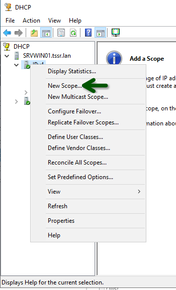
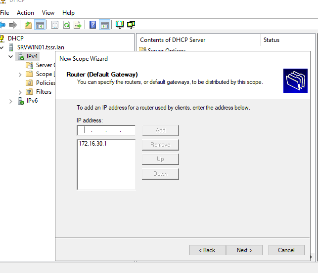

## Création d'une nouvelle zone  

* Se rendre dans DHCP manager

* Renseigner la plage IP, comme exemple avec le VLAN 30 :
  * de 172.16.30.2 à 172.26.30.220

* Ajouter des exclusions si besoin dans cette plage

* Bien renseigner l'adresse de passerrelle du routeur pfSense  

Ne pas oublier de configurer le DHCP relay dans pfSense.

## IP inverse ?
