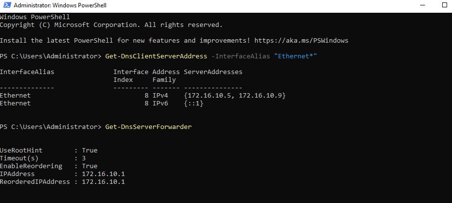
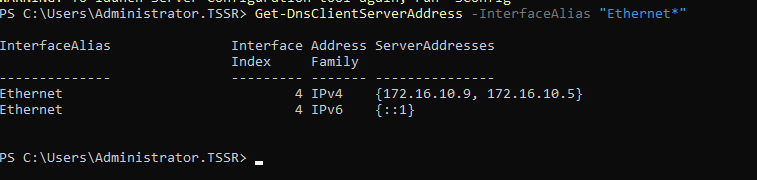
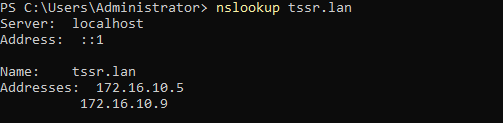
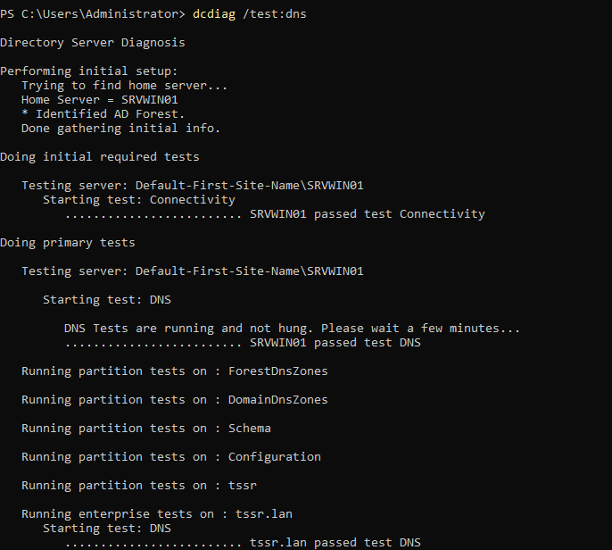

# DNS

## Configuration du rôle DNS sur chaque DC

* DC principal, avec son adresse IP et celle du DC secondaire en alternative

  

* DC secondaire

## DNS Forwarder

* Sur chaque DC ajouter un forwarder vers le pare-feu pfSense  
`Add-DnsServerForwarder -IPAddress 172.16.10.1`

## Verfication

### Nslookup

`nslookup tssr.lan`  
Pour vérifier rapidement les adresse IP retournées pour le nom de domaine.

### Dcdiag

`dcdiag /test:dns`

Pour diagnostiquer les problèmes liés au service DNS dans un environnement Active Directory.  Elle permet de vérifier que les enregistrements DNS essentiels (comme les enregistrements A, CNAME) sont correctement enregistrés et que le DNS fonctionne correctement pour la réplication du répertoire

