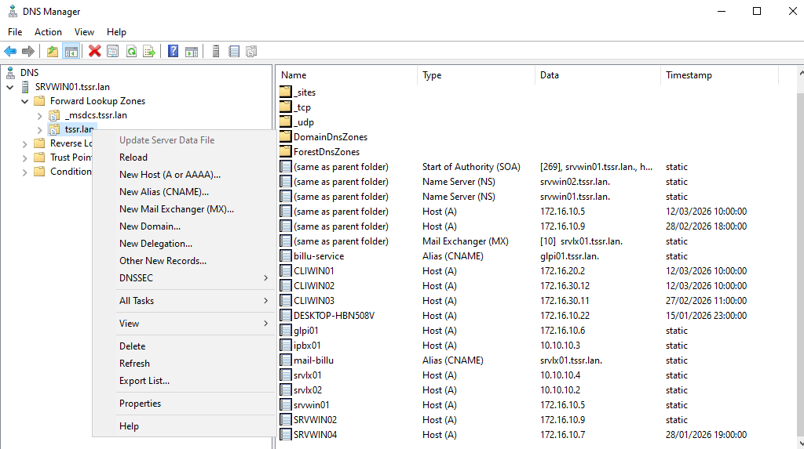
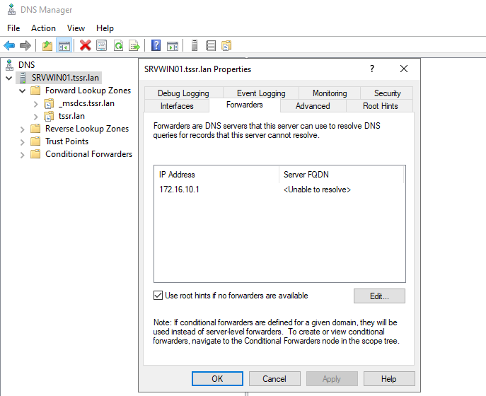

## Ajout d'une nouvelle zone

### Configuration de la zone DNS directe

* Ouvrir Gestionnaire DNS (dnsmgmt.msc)  
* Développer le nom de votre serveur  
* Clic droit sur Zones de recherche directes => Nouvelle zone...  
* Choisir Zone principale (cocher "Stocker la zone dans Active Directory")

"Vers tous les serveurs DNS de ce domaine" (recommandé pour un domaine unique)
"Vers tous les serveurs DNS de cette forêt" (pour plusieurs domaines)

Entrer le nom de la zone
Configurer les mises à jour dynamiques : Autoriser uniquement les mises à jour dynamiques sécurisées

### Zone inverse

La zone inverse est essentielle pour certaines applications et pour la sécurité (reverse DNS lookup)

## Ajouter des enregistrements DNS

* Se rendre sur le serveur DNS, clic droit puis DNS Manager et ajouter l'enregistrement souhaité dans la zone DNS

## Ajout de DNS forwarders en GUI

* Accéder aux propriétés du serveur

* Dans le volet gauche, clic droit sur le nom de votre serveur DNS
Sélectionner Propriétés

* Configurer les redirecteurs

