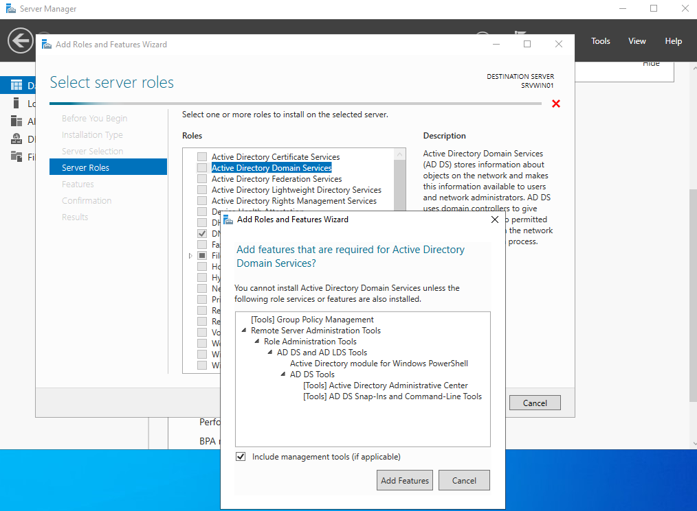
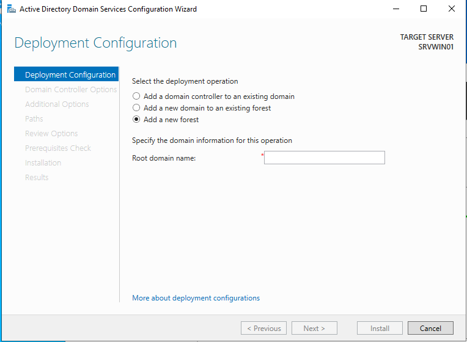
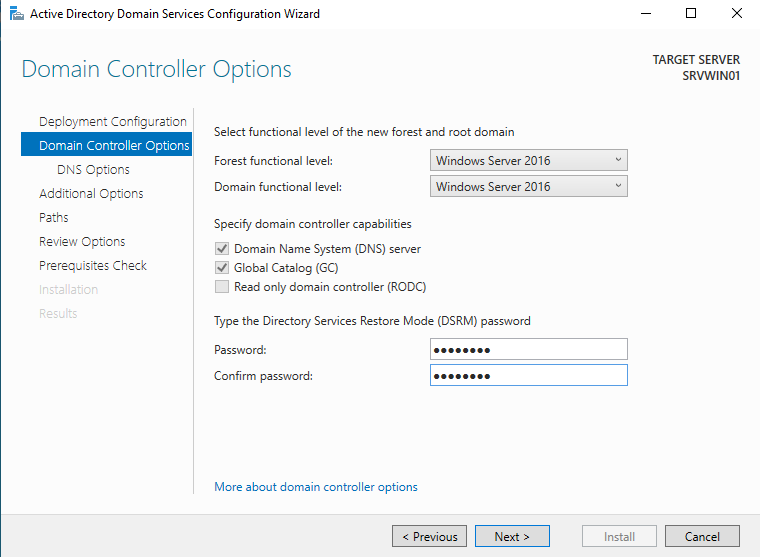
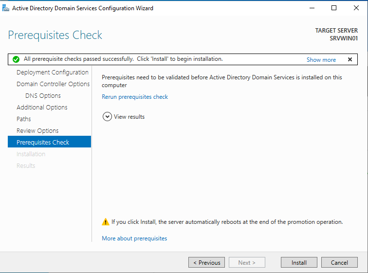
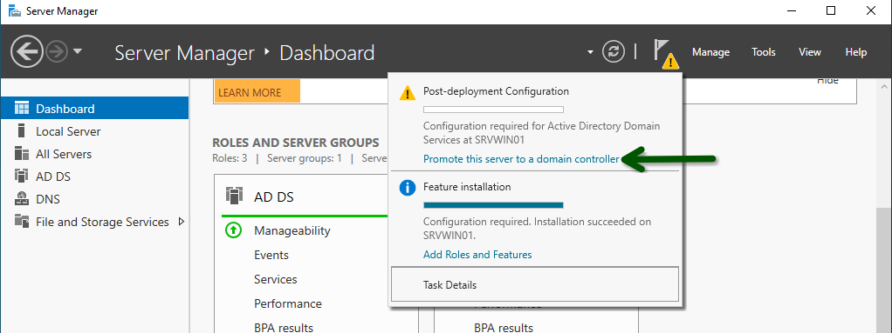

### Ajout du rôle Active directory Domain Services

* Add Roles and Features
* Selectionner le service
* Suivre les étapes d'installation

* On configure une nouvelle fôret
* Le nom de domaine spécifié est : **tssr.lan**  

* Laisser coché DNS server et Global Catalog
* Entrez un mot de passe  

***Si tout est ok, on clique sur install***

***À la fin de l'installation, ne pas oublier de promouvoir le serveur en DC***

