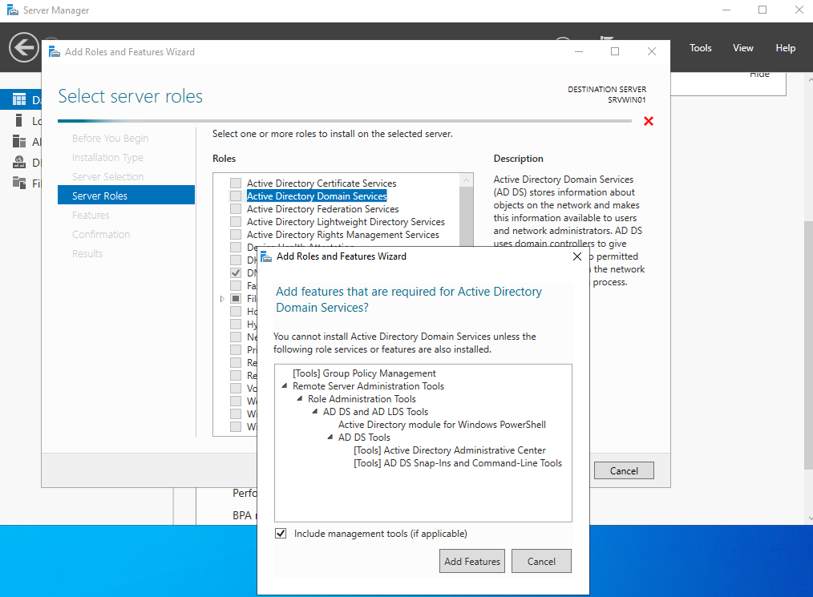
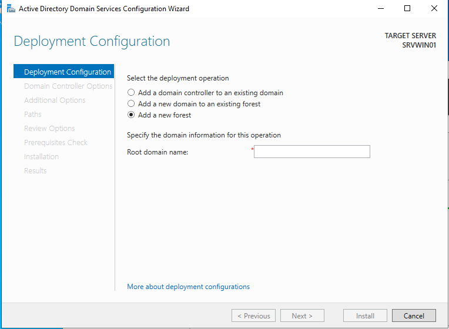
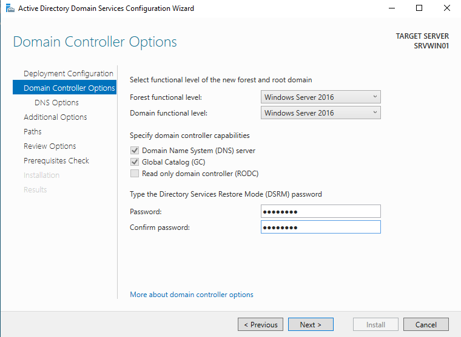
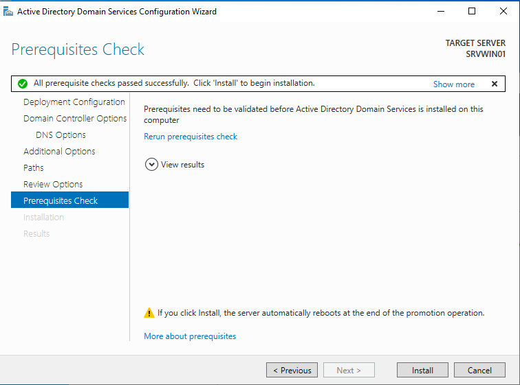
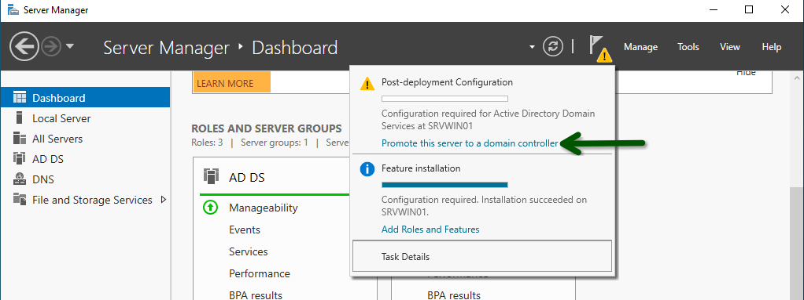
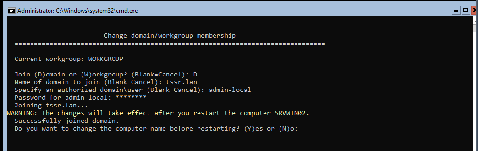
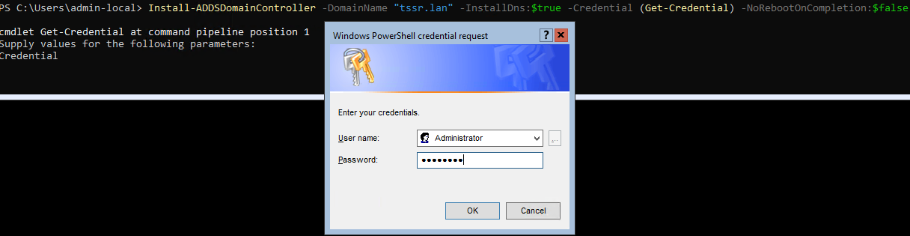
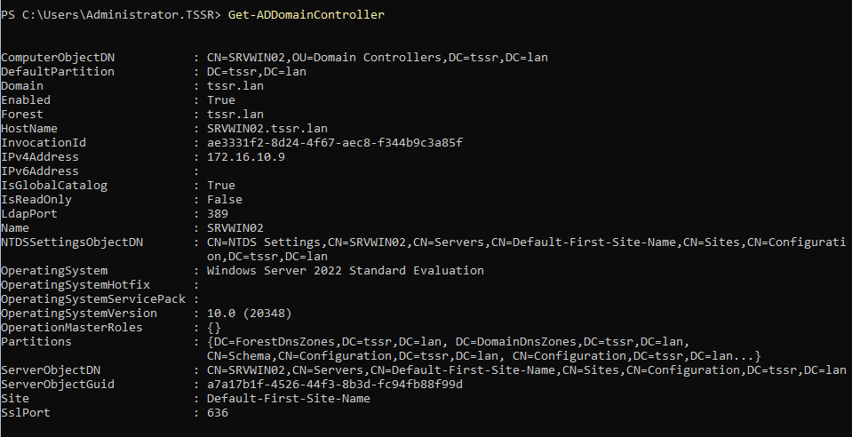
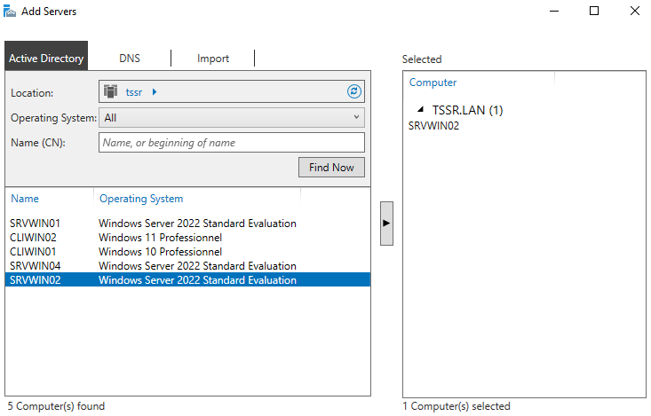
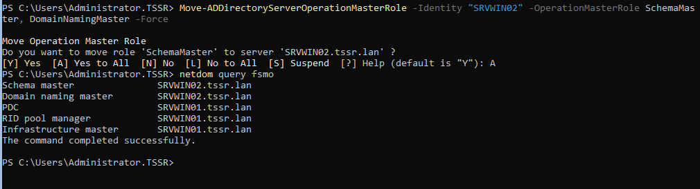

## Ajout du rôle Active directory Domain Service

>L'ajout de ce rôle est conseillé avant les autres, notamment le DNS.

* Add Roles and Features
* Selectionner le service
* Suivre les étapes d'installation

* On configure une nouvelle fôret
* Le nom de domaine spécifié est : **tssr.lan**  

* Laisser coché DNS server et Global Catalog
* Entrez un mot de passe  

***Si tout est ok, on clique sur install***

***À la fin de l'installation, ne pas oublier de promouvoir le serveur en DC***

## Ajout d'un deuxième serveur

### Installation du serveur windows core en redondance AD-DS | DNS

* Configurer IP, DNS et rejoindre le domaine avec un compte et MDP du DC principal

  

* Installer le rôle AD-DS avec la commande  
 `Install-WindowsFeature AD-Domain-Services -IncludeManagementTools`

* Promouvoir le serveur en DC secondaire  

    `Install-ADDSDomainController
    -DomainName "tssr.lan"
    -InstallDns:$true
    -Credential (Get-Credential)
    -DatabasePath "C:\Windows\NTDS"
    -LogPath "C:\Windows\NTDS"
    -SysvolPath "C:\Windows\SYSVOL"
    -NoRebootOnCompletion:$false
    -Force:$true`  
  
* Get credential : avec un compte du DC principal

  

* La commande `Get-ADDomainController` devrait lister le nouveau DC

* Ajout du serveur en GUI sur le DC principal

  

### Répartition des rôles FSMO

* Déplacer les rôles vers SRVWIN02
`Move-ADDirectoryServerOperationMasterRole -Identity "SRVWIN02"
-OperationMasterRole SchemaMaster, DomainNamingMaster-Force`

* Vérifier avec `netdom query fsmo`  

