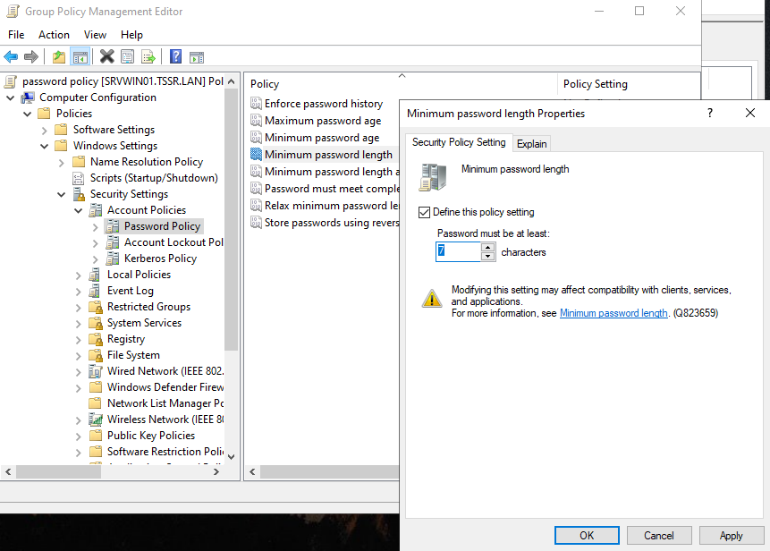
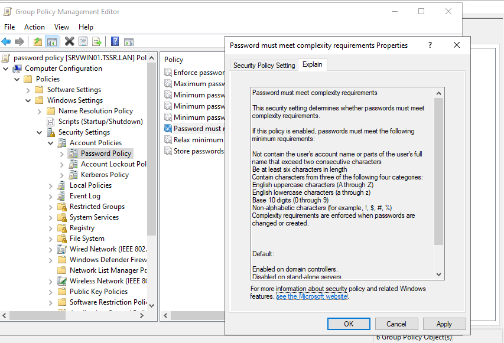
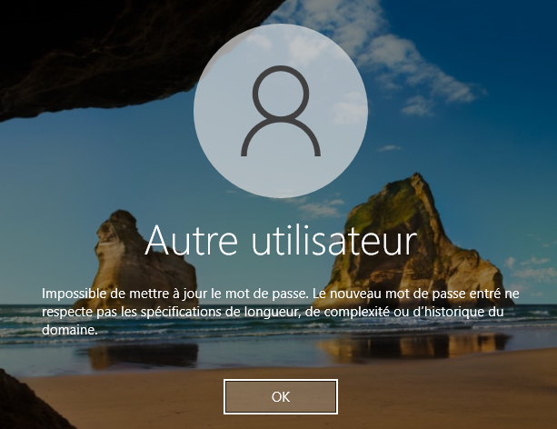
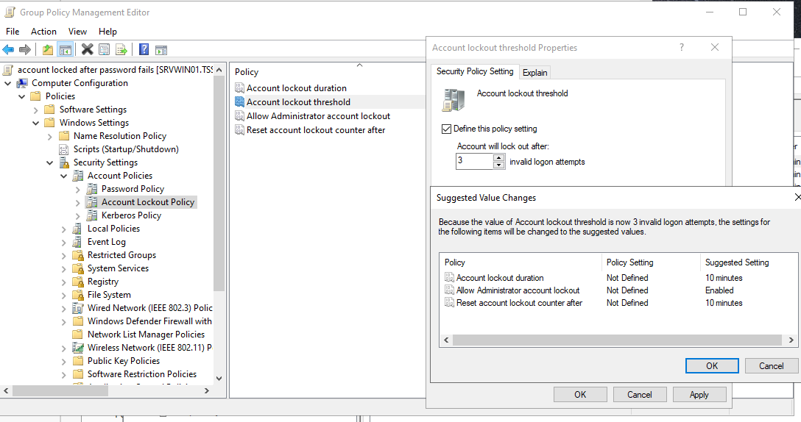
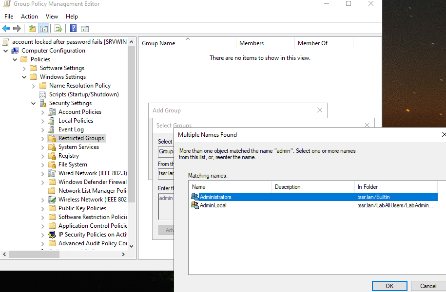
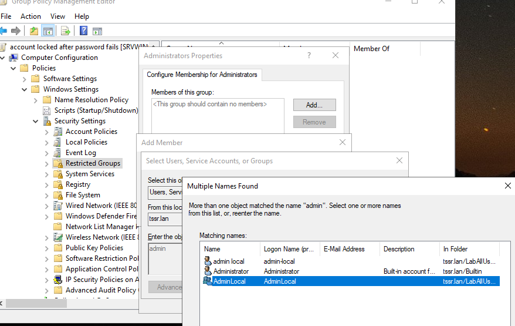
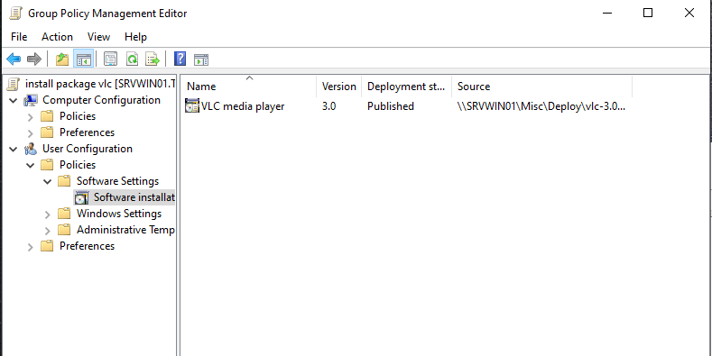
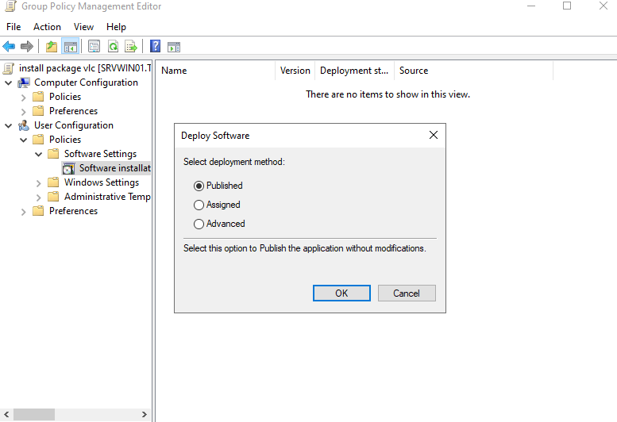
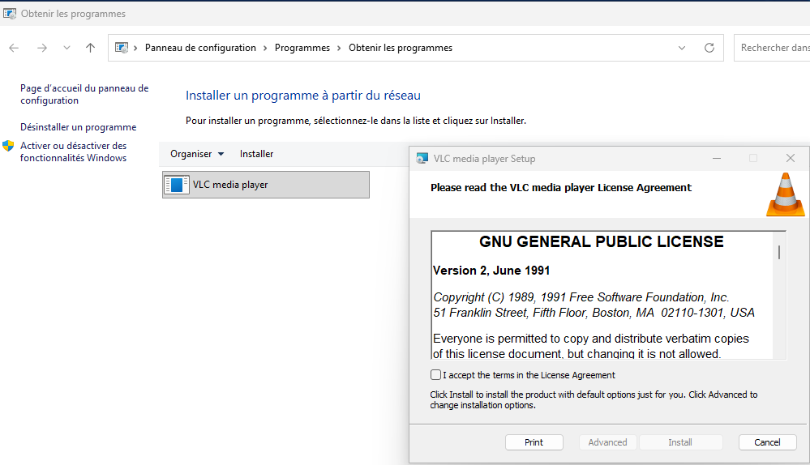

## Méthode AGDLP pour création d'utilisateurs, groupes et Oraganizational Units (OU)

A   -> Account => Les utilisateurs  
G   -> Global groups => Les groupes métiers  
DL  -> Domain Local Groups => Les groupes de droits  
P   -> Permissions => Les permissions sur les ressources  

### Oraganizational Units (OU) à créer par départements

| Département                          | Nom OU            |
|--------------------------------------|--------------------|
| Communication et Relations publiques | LabUsers-com_rp    |
| Département Juridique                | LabUsers-judic     |
| Développement logiciel               | LabUsers-dev       |
| Direction                            | LabUsers-dir       |
| DSI                                  | LabUsers-dsi       |
| Finance et Comptabilité              | LabUsers-fin_compt |
| QHSE                                 | LabUsers-qhse      |
| Service Commercial                   | LabUsers-business  |

* Possible en graphique ou avec la commandes powershell suivante (exemple avec le premier département) :

`New-ADOrganizationalUnit -Name 'LabUsers-com_rp' -Path "DC=tssr,DC=lan" -Description 'Communication et Relations publiques'`

### Groupes à créer par départements

| Département                         | Noms Groupe            |
|--------------------------------------|--------------------|
| Communication et Relations publiques | GrpUsers-com_rp    |
| Département Juridique                | GrpUsers-judic     |
| Développement logiciel               | GrpUsers-dev       |
| Direction                            | GrpUsers-dir       |
| DSI                                  | GrpUsers-dsi       |
| Finance et Comptabilité              | GrpUsers-fin_compt |
| QHSE                                 | GrpUsers-qhse      |
| Service Commercial                   | GrpUsers-business  |

* Possible en graphique ou avec la commandes powershell suivante (exemple avec le premier département) :

`New-ADGroup -Name 'GrpUsers-com_rp' -GroupScope Global -GroupCategory Security -Path 'OU=LabUsers-com_rp,DC=tssr,DC=lan' -Description 'Groupe communication et rp'`

* Le groupe est alors créé dans l'OU correspondante avec une catégorie "Sécurité" et un scope "Global"

### Création des utilisateuSrs  

* Possible en powershell, ici en graphique :
  * Se rendre dans Tools/Active Directory UsersS and computers puis clic droit New User
  * Renseigner les informations, next et décocher le changement de mot de passe à la première connexion  

  

* On peut ensuite aller dans les propriétés de l'utilisateur créé pour renseigner d'autres informations.  

    Ici la fonction, le département, se rattacher à un manager (Noemie Leloir) et voir quel utilisateur est sous son management (Loic Blanc).

### Ajout des utilisateurs aux groupes

* Possible en graphique ou avec la commandes powershell suivante (exemple avec le premier utilisateurs) :  

`Add-ADGroupMember -Members "Loic Blanc" -Identity "GrpUsers-com_rp"`

### Ajout des utilisateurs dans les OU

***IMPORTANT***: Pour le bon fonctionnenment des GPO, les utilisateurs ***et pas seulements les groupes***  doivent êtres placès dans les OU correspondantes  

* Structure hierarchique avec une OU globale utilisateurs et des OU par départements.

## Création de GPO

### Ajout des utilisateurs dans les OU

Si aucune GPO ne fonctionne (même Default Domain Policy), message "refusés"

Causes principales rencontrées :

* Utilisateurs laissés dans CN=Users (container système) = pas de GPO OU appliquée.
* Blocage d'héritage activé sur OU parent ou domaine (caché dans Group Policy Inheritance).
* Authenticated Users et Domain computers sans Read dans Delegation Advanced de la GPO.
* Bien verifier que l'ordinateur n'est pas dans le container système mais le déplacer dans une OU créée.

### Structure optimale d'une GPO pour éviter des problèmes

Ici avec une GPO ciblant les utilisateurs du groupe communication et rp.

Création de la GPO dans le dossier Group policy object, "enable" ou "disable computer settings" et "link" de la GPO dans l'OU LabUsers-com_rp

**Paramétrage de la GPO**  

Security Filtering :

* GrpUsers-com_rp

Delegation :

* Authenticated Users -> Read
* Domain Computers -> Read (redondant mais bonne pratique)
* GrpUsers-dsi -> Read + Apply GP  

* Les utilisateurs du département communication n'ont plus accès au panneau de configuration.
* Tous les utilisateurs de l'entreprise ont le même fond d'écran, avec la GPO définie dans l'OU LabAllUsers qui contient les OU de tous les départements.Le security filtering est alors authenticated users.
* La commande `gpresult /R` affiche les RSOP (Resultant Set of Policy) appliqués à l'utilisateur.
Ici un utilisateur du groupe communication/rp.  

### GPO : Politique de mot de passe (complexité, longueur, etc.)  

* **Longueur** : Computer configuration / Windows Settings / Password Policy / Minimum password lenght

  

* **Complexité** : Computer configuration / Windows Settings / Password Policy / Password must meet complexity requirements
***L'onglet explain detaille les connditions applicables (ne contient pas le nom d'utilisateur, longueur minimum 6, caractères spéciaux...)***  

* Activer et lier la GPO à la racine du domaine
* Resultat à la demande de changement de mot de passe à la première connexion d'un utilisateur.  

### GPO : Verrouillage de compte (blocage de l'accès à la session après quelques erreur de mot de passe)  

* Computer configuration / Windows Settings / Account Lockout Policy / Account lockout threshold.
Ici 3 essais maximums  
***Des valeurs suggèrées (modifiables ensuite) sont appliquées pour définir le temps avant un reset des essais de mots passes ou une tentative de reconnexion. Le temps avant reset de l'essai ne peut être alors inférieur à celui pour tenter de se reconnecter***  

## GPO : Gestion d'un compte du domaine qui est administrateur local des machines

* Créer un compte <admin-local@tssr.lan>
* Le placer dans un groupe AdminLocal et une OU LabAdminLocal
* Créer la GPO : Dans Computer configuration / Security Settings / Restricetd groups
  * Ajouter le groupe Administrators
  * Dans propriété d'Administrators, ajouter le groupe AdminLocal
  * Possible d'ajouter des membres de la DSI dans le groupe AdminLocal (ils auront donc les droits d'administrations sur leurs sessisons)
  * Lier la GPO à l'OU Computer et filtrer avec Domain Computers et Groupe DSI
  * Il serait possible de limiter le filtre aux machines de la DSI pour plus de securité.

## GPO : installation d'un programme

* Dans software settings / Software installation / clic droit / Add package
* Renseigner un chemin partagé depuis le serveur avec un fichier en .msi

* Plusieurs options d'installation :

  * Published (recommandé pour une configuration utilisateur : l'utilisateur peut l'installer via "Programmes et fonctionnalités" ou "Ajouter/Supprimer")
  * Assigned installation auto au login, plus silencieux.

* Lier la GPO et filtrer selon les besoins
* Résultat sur un poste client avec une installation Published :

