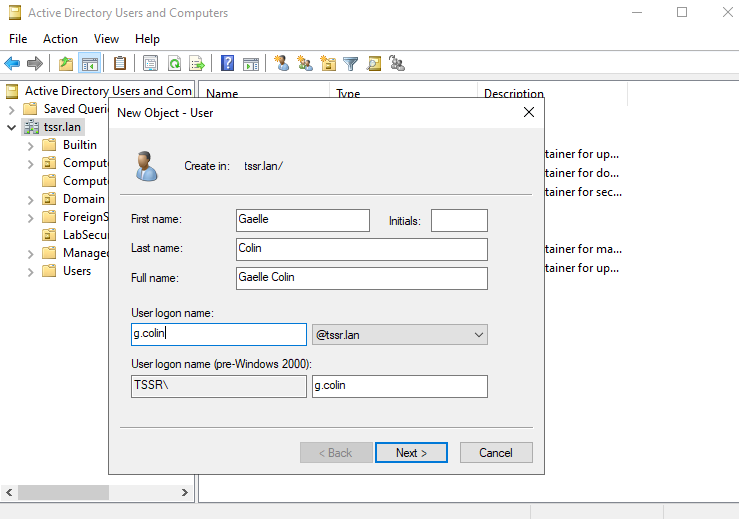
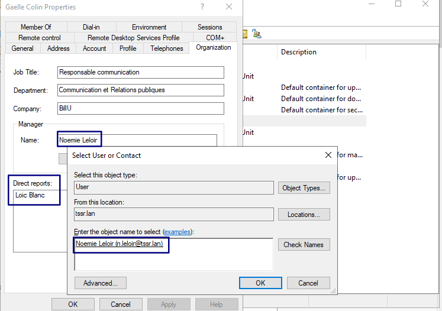

## Méthode AGDLP pour création d'utilisateurs, groupes et Oraganizational Units (OU)

A   -> Account => Les utilisateurs  
G   -> Global groups => Les groupes métiers  
DL  -> Domain Local Groups => Les groupes de droits  
P   -> Permissions => Les permissions sur les ressources  

### Oraganizational Units (OU) à créer par départements

| Département                          | Nom OU            |
|--------------------------------------|--------------------|
| Communication et Relations publiques | LabUsers-com_rp    |
| Département Juridique                | LabUsers-judic     |
| Développement logiciel               | LabUsers-dev       |
| Direction                            | LabUsers-dir       |
| DSI                                  | LabUsers-dsi       |
| Finance et Comptabilité              | LabUsers-fin_compt |
| QHSE                                 | LabUsers-qhse      |
| Service Commercial                   | LabUsers-business  |

* Possible en graphique ou avec la commandes powershell suivante (exemple avec le premier département) :

`New-ADOrganizationalUnit -Name 'LabUsers-com_rp' -Path "DC=tssr,DC=lan" -Description 'Communication et Relations publiques'`

### Groupes à créer par départements

| Département                         | Noms Groupe            |
|--------------------------------------|--------------------|
| Communication et Relations publiques | GrpUsers-com_rp    |
| Département Juridique                | GrpUsers-judic     |
| Développement logiciel               | GrpUsers-dev       |
| Direction                            | GrpUsers-dir       |
| DSI                                  | GrpUsers-dsi       |
| Finance et Comptabilité              | GrpUsers-fin_compt |
| QHSE                                 | GrpUsers-qhse      |
| Service Commercial                   | GrpUsers-business  |

* Possible en graphique ou avec la commandes powershell suivante (exemple avec le premier département) :

`New-ADGroup -Name 'GrpUsers-com_rp' -GroupScope Global -GroupCategory Security -Path 'OU=LabUsers-com_rp,DC=tssr,DC=lan' -Description 'Groupe communication et rp'`

* Le groupe est alors créé dans l'OU correspondante avec une catégorie "Sécurité" et un scope "Global"

### Création des utilisateurs  

* Possible en powershell, ici en graphique :
  * Se rendre dans Tools/Active Directory Users and computers puis clic droit New User
  * Renseigner les informations, next et décocher le changement de mot de passe à la première connexion  

  

* On peut ensuite aller dans les propriétés de l'utilisateur créé pour renseigner d'autres informations.  

    Ici la fonction, le département, se rattacher à un manager (Noemie Leloir) et voir quel utilisateur est sous son management (Loic Blanc).

### Ajout des utilisateurs aux groupes

* Possible en graphique ou avec la commandes powershell suivante (exemple avec le premier utilisateurs) :  

`Add-ADGroupMember -Members "Loic Blanc" -Identity "GrpUsers-com_rp"`
