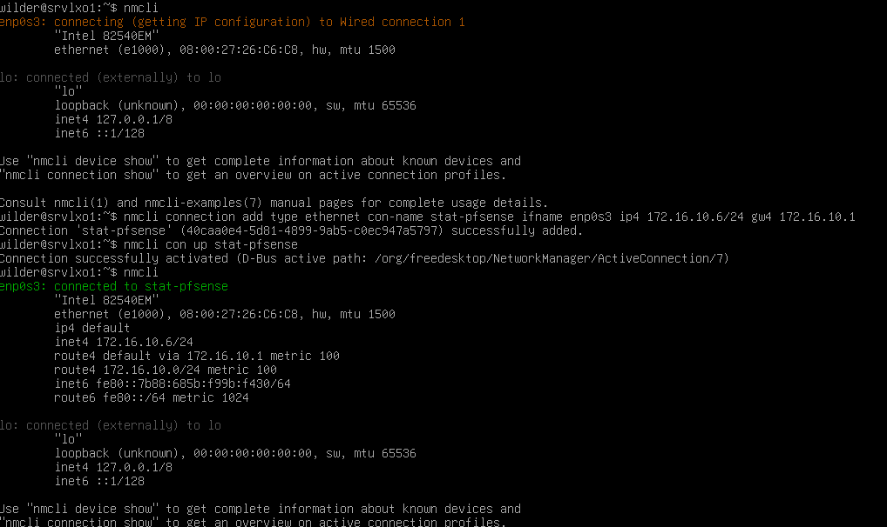
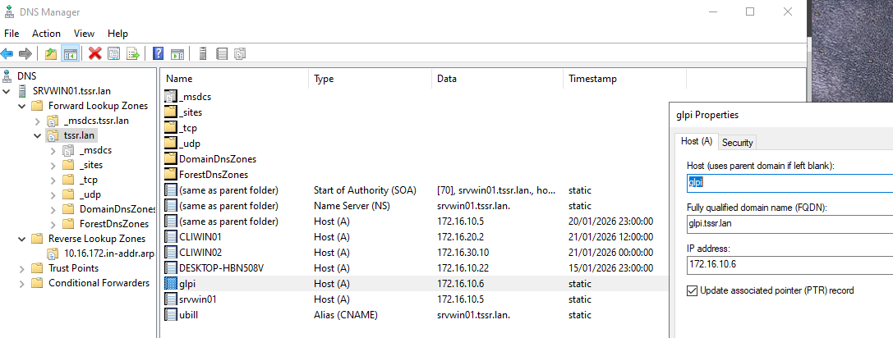
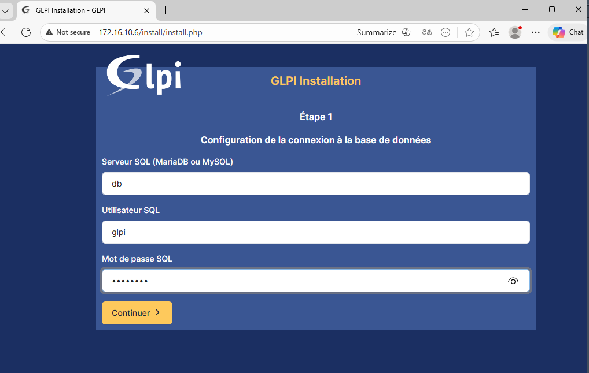

# Installation de GLPI

## Prérequis

Une image ISO de ubuntu-server

Configuration de la VM :

* Nom : GLPO1
* Type : Linux → Debian en install non graphique (64-bit)
* RAM : 1 à 2 Go
* CPU : 2 cœurs
* Disque : 20G

Attention a ne pas installer "serveur-web" ou Apache car demande une configuration supplémentaire pour être utiliser en paralléle du service Docker

## Connexion avec NMCLI

* Installer NMCLI :  
`sudo apt install network-manager`
* Créer une nouvelle connexion "stat-pfsense" et l'attribuer à l'interface

* Ne pas oublier le DNS
  * `nmcli con modify stat-pfsense ipv4.dns 172.16.10.5`
* Ajouter l'enregistrement A et PTR dans DNS Manager  

## Installation des composants Docker

### Créer le dossier pour les clés si nécessaire

`sudo install -m 0755 -d /etc/apt/keyrings`

### Télécharger et convertir la clé publique Docker en format binaire

`curl -fsSL <https://download.docker.com/linux/debian/gpg> | sudo gpg --dearmor -o /etc/apt/keyrings/docker.gpg`

### Donner les bons droits à la clé (lecture pour tous, mais pas modifiable)

`sudo chmod a+r /etc/apt/keyrings/docker.gpg`

### Ajouter le dépôt officiel Docker

`echo \
"deb [arch=$(dpkg --print-architecture) signed-by=/etc/apt/keyrings/docker.gpg] https://download.docker.com/linux/debian \
$(lsb_release -cs) stable" | sudo tee /etc/apt/sources.list.d/docker.list > /dev/null`

### Mettre à jour la liste des paquets

`sudo apt update`

### Installation de docker et docker compose

`sudo apt install docker-ce docker-ce-cli containerd.io docker-compose-plugin -y`

### Activer Docker au demarrage et ajout au groupe sudo (pour eviter ressaisies sudo)

`systemctl enable --now docker`

`sudo usermod -aG docker $USER`

### Vérification de l'installation Docker

`docker --version`

`docker compose version`

## Installation de GLPI avec Docker

* Créer un nouveau dossier dans /opt/glpi
* Y éditer un fichier docker-compose.yml (fichier dans les resssources)
  * Serveur : db (nom du service dans compose)
  * Utilisateur : glpi
  * Mot de passe : Azerty1*
  * Base : glpi
  * Lancer avec `docker compose up -d`

## Installation du service GLPI

* Lancer l'installation via l'adresse du serveur (172.16.10.6)

* Indiquer le serveur SQL db
* L'utilisateur glpi
* Le mot de passe defini dans le fichier compose

