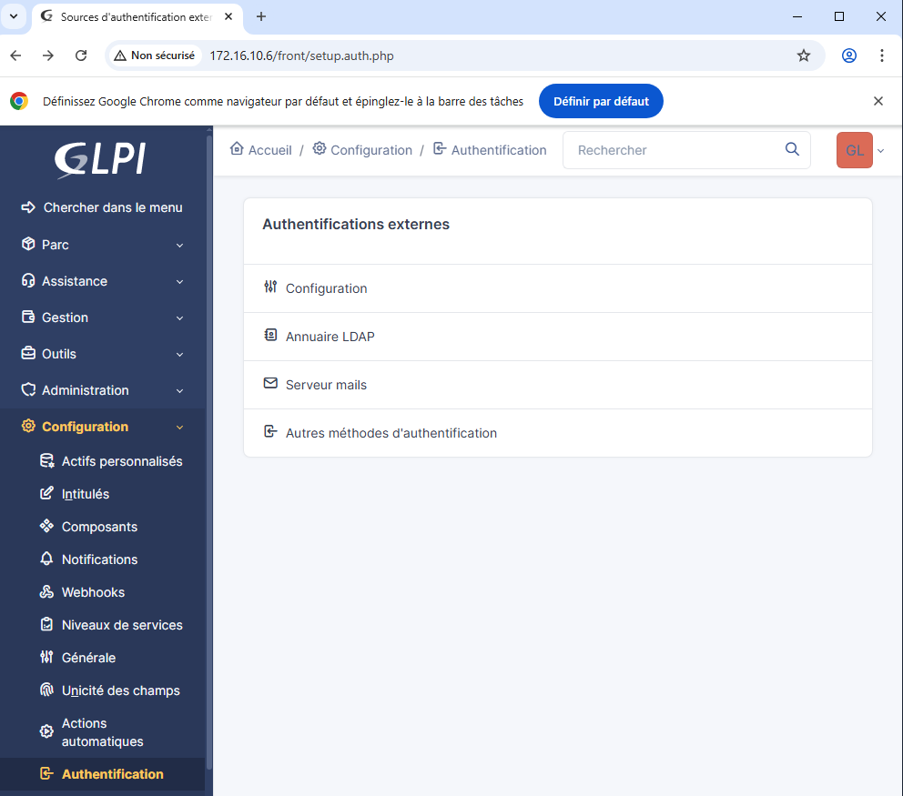
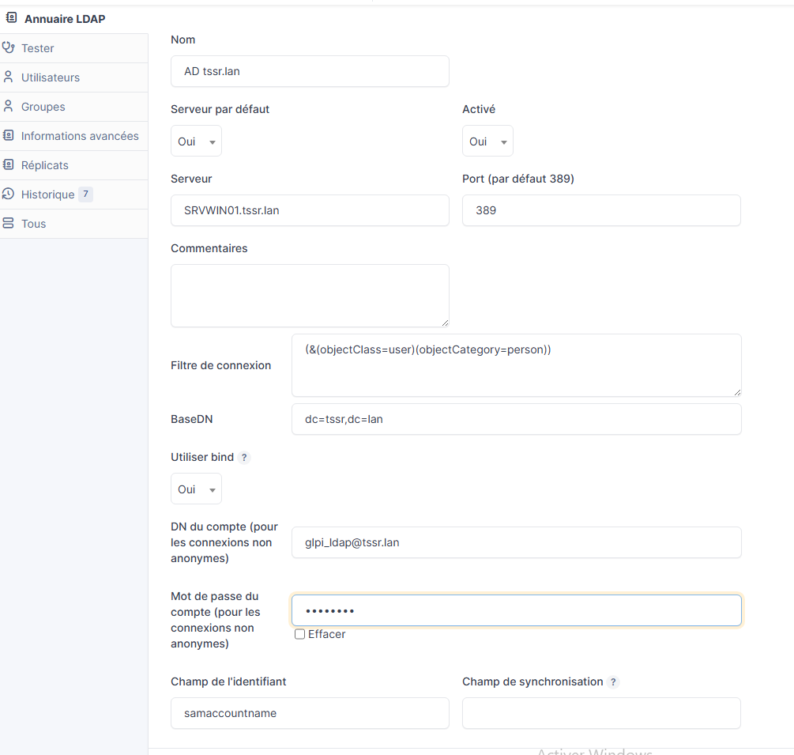
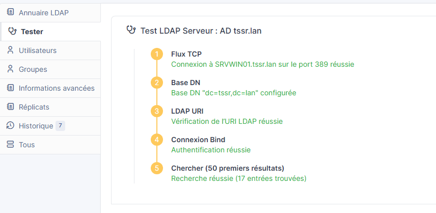
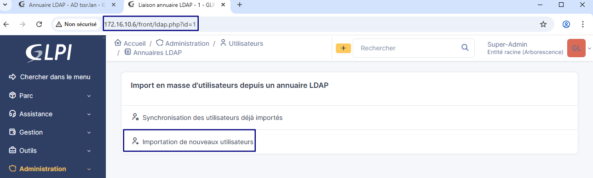
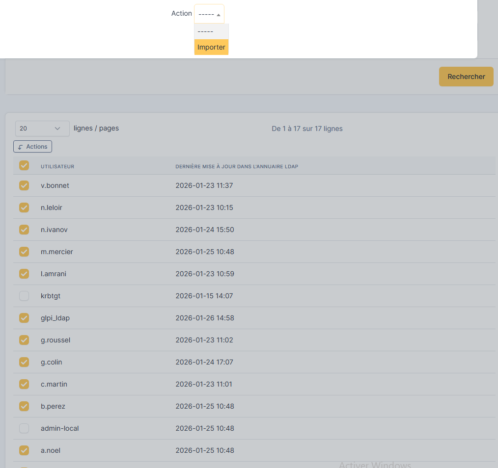
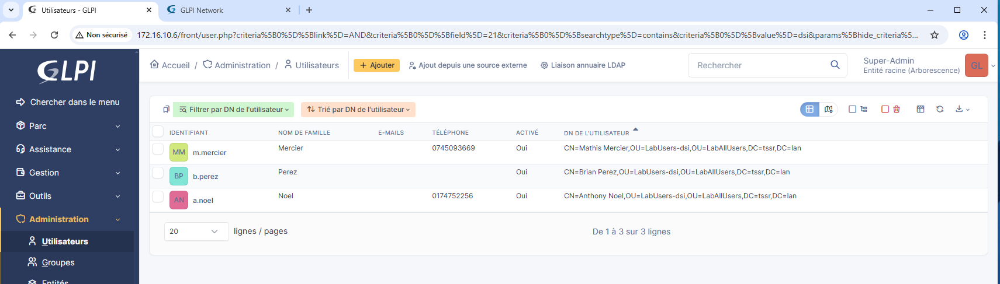
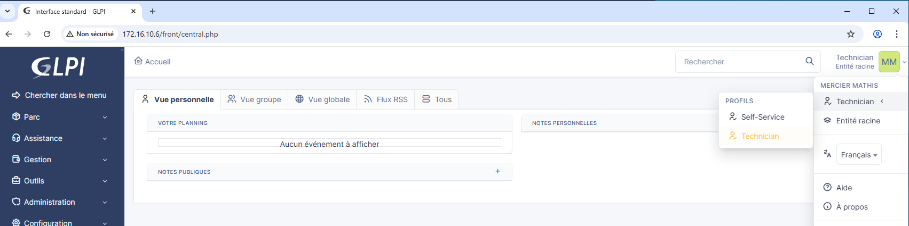

# Guide d'utilisation GLPI

## Connexion LDAP à Active Directory

* Se rendre dans la configuration puis authentification et Annuaire LDAP

* Renseigner :
  * Nom de l'annuaire
  * Serveur : SRVWIN01.tssr.lan
  * Port par défaut
  * Filre de connexion
  * ...
  * Champ d'identifiantr samAcoountName **-Important-** pour qu'un utilisateur de l'AD puisse se connecter à GLPI avec ses identifiants

* Si la configuration est correcte, le test affiche des resultats

* Se rendre dans Administration/utilisateurs ou sur l'adresse 172.16.10.6/front/ldap.php?id=1
pour importer les utilisateurs
  

  

* Il est possible dans l'onglet configuration d'activer une synchronisation automatique  
* Les utilisateurs sont maintenant importés et il est possible de se connecter avec un compte AD.  
 On arrive alors sur la page d'acceuil en tant qu'utilisateur "self-service"
  

## Attribution de profils

 Les profils définissent les **droits et permissions** de chaque utilisateur dans GLPI. Voici les principaux profils par défaut :

### 📋 Profils principaux GLPI

#### 🔴 Super-Admin

* **Tous les droits** sur GLPI

* Gestion complète : configuration, plugins, profils, entités
* Accès à toute la base de données
* **Usage** : Administrateurs système GLPI

#### 🟠 Admin

* Droits d'administration étendus

* Peut gérer utilisateurs, groupes, configurations
* Ne peut pas modifier la configuration système critique
* **Usage** : Administrateurs fonctionnels

#### 🟡 Supervisor (Superviseur)

* Peut **voir et gérer tous les tickets** de son équipe/entité

* Peut attribuer des tickets aux techniciens
* Accès aux statistiques et rapports
* Gestion du parc informatique
* **Usage** : Responsables d'équipe, managers IT

#### 🟢 Technician (Technicien)

* Peut **traiter les tickets** qui lui sont assignés

* Peut voir les tickets de son groupe
* Gestion du matériel (ordinateurs, périphériques, etc.)
* Peut créer des tickets pour les utilisateurs
* **Usage** : Équipe support/helpdesk

#### 🔵 Hotliner

* Similaire au technicien mais avec **moins de droits** sur le parc

* Principalement centré sur la **gestion des tickets**
* Réponse de premier niveau
* **Usage** : Support niveau 1, centre d'appels

#### 🟣 Observer (Observateur)

* Accès en **lecture seule**

* Peut consulter tickets, matériel, statistiques
* Ne peut rien modifier
* **Usage** : Direction, audit, consultation

#### ⚪ Self-Service (Utilisateur final)

* Peut uniquement **créer ses propres tickets**

* Voir **ses tickets** et leur suivi
* Voir le **matériel** qui lui est assigné
* **Pas d'accès** à l'inventaire complet ni aux tickets des autres
* **Usage** : Tous les utilisateurs standards de l'entreprise

### 📊 Tableau comparatif simplifié

| Action | Self-Service | Technicien | Supervisor | Admin |
|--------|--------------|------------|------------|-------|
| Créer un ticket | ✅ (sien) | ✅ | ✅ | ✅ |
| Voir tous les tickets | ❌ | 🟡 (son groupe) | ✅ | ✅ |
| Traiter les tickets | ❌ | ✅ | ✅ | ✅ |
| Gérer l'inventaire | ❌ | ✅ | ✅ | ✅ |
| Statistiques | ❌ | 🟡 (limitées) | ✅ | ✅ |
| Gérer utilisateurs | ❌ | ❌ | 🟡 (limité) | ✅ |
| Configuration GLPI | ❌ | ❌ | ❌ | ✅ |

#### 💡 Recommandations

Lors de l'import depuis l'AD, attribuez :

* **Self-Service** : à tous les utilisateurs par défaut
* **Technicien** : aux membres de votre équipe IT
* **Supervisor** : aux responsables d'équipe
* **Admin** : uniquement 1-2 personnes de confiance

 Les profils peuvent être personnalisés dans GLPI via **Configuration > Profils** pour adapter finement les droits selon vos besoins organisationnels.

### Selection des utilisateurs et attribution de profils

* Filtrage des utilisateurs avec dn qui contient "dsi"

* Ajout du profil admin a a.noel et techncicien aux autres
* Le choix du profil est possible lors de la connexion à GLPI

