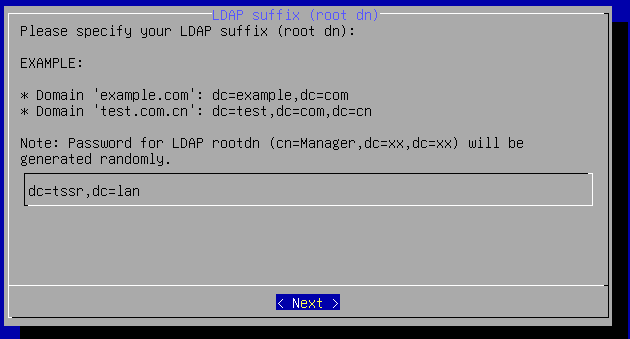
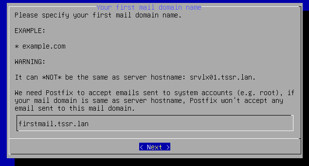
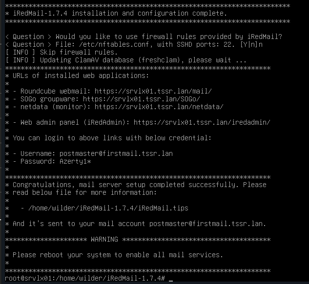
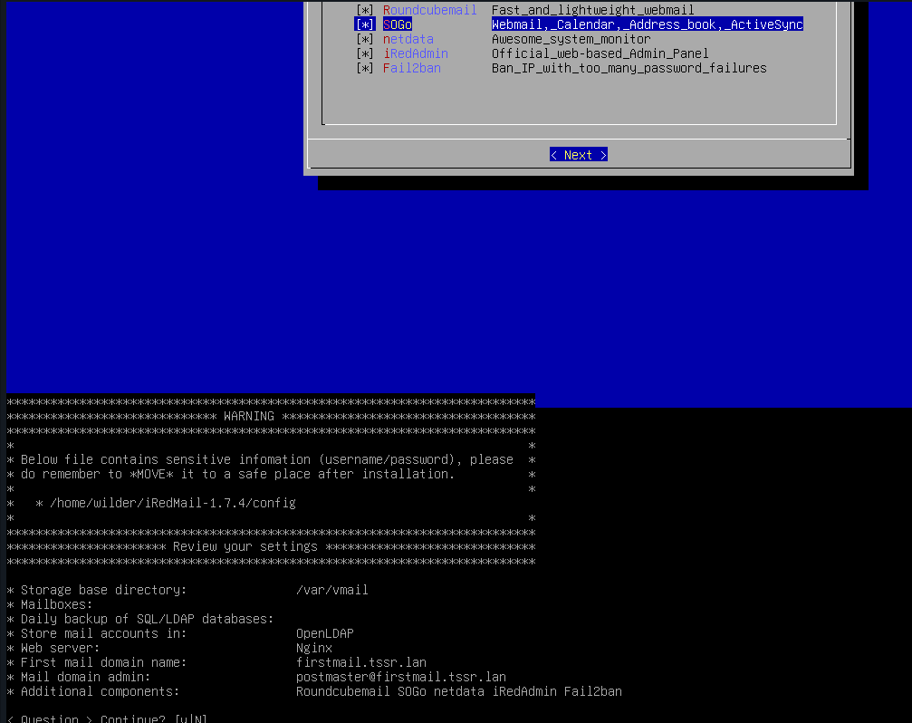
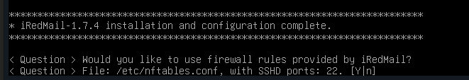
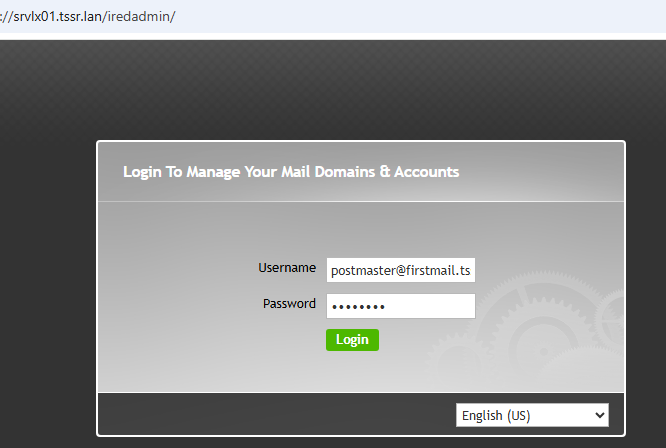

# Installation iRedMail

* Renseigner le nom de domaine

* Renseigner le premier mail, servira à la première connexion

* Installation terminée, affichage du resumé

  

* Connexion à l'interface d'administration

