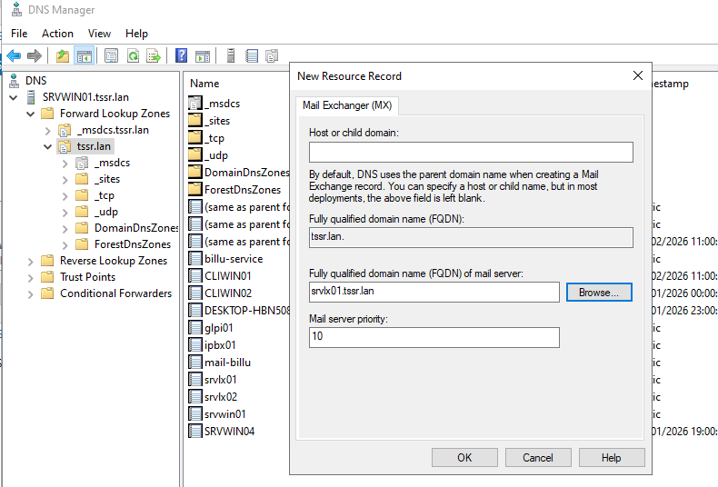
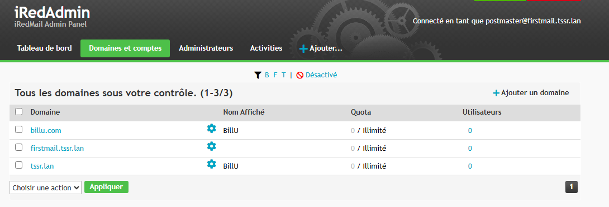
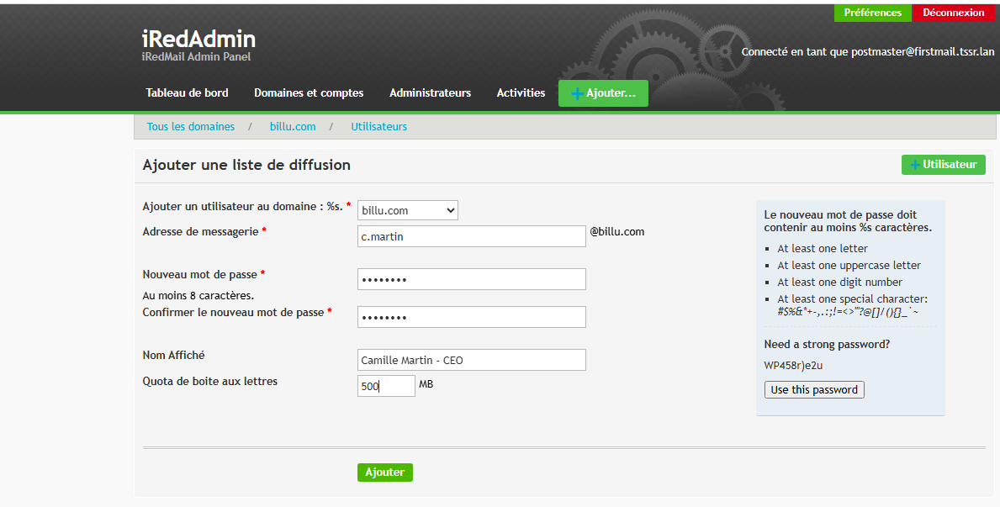
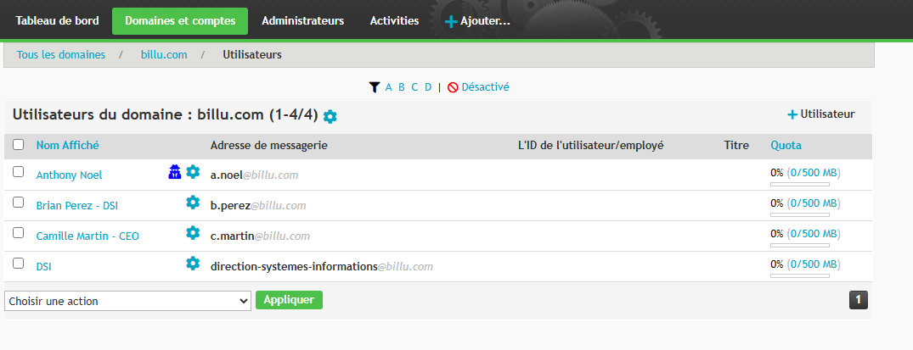
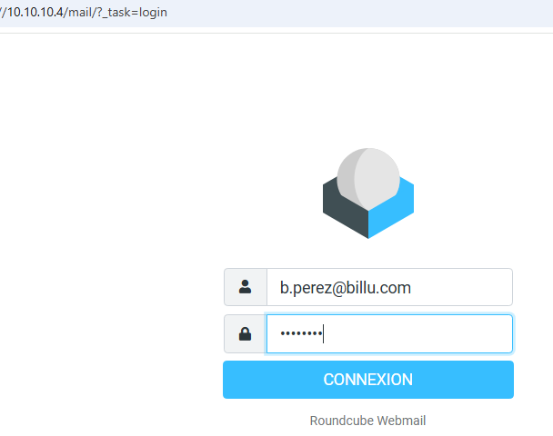
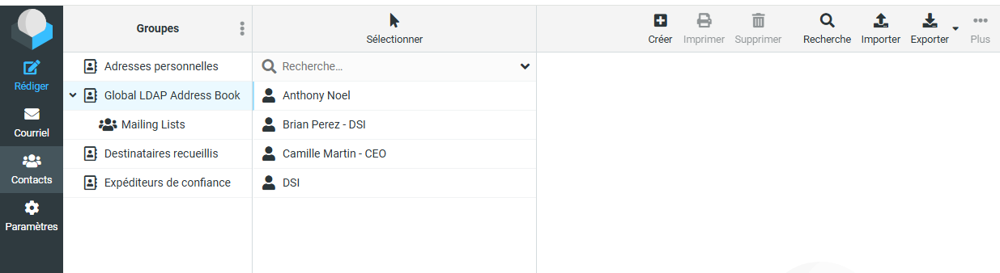
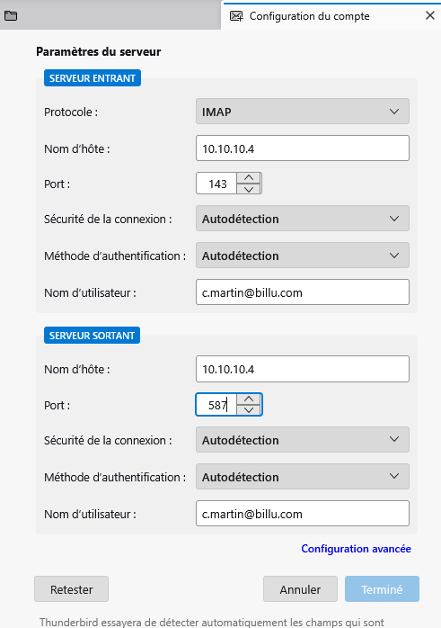
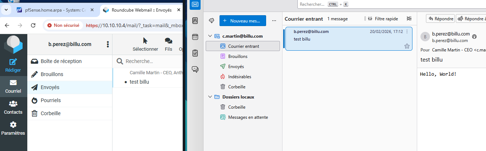

# Configuration post install

## Enregisrement MX sur le DNS

## Depuis iRedmail/admin

* Ajouter un nom de domaine comme "billu.com"  

* Créer des utilisateurs rattachés à ce domaine

* Possible de définir des utilisateurs "Administrateurs"

## Utilisation depuis le webmail  

* Connexion avec les logins précédemment créés

## Ajout de compte en local avec Thunderbird

* Remplir comme ci-dessus

* Accépter le certificat  
* Test réussi pour l'envoi de mail entre webmail et Thunderbird

