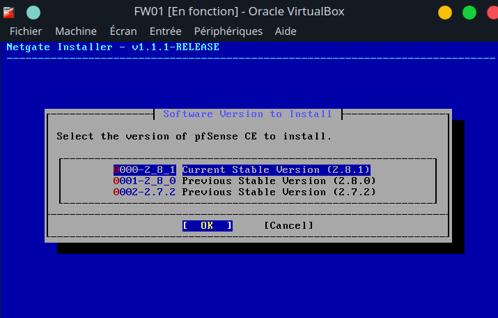
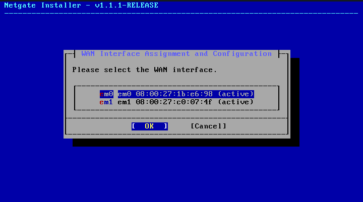
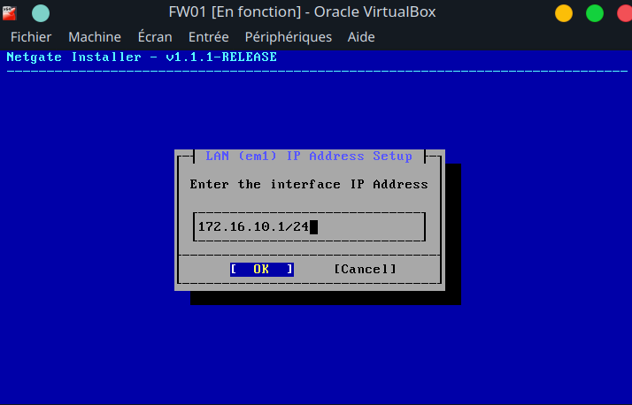

## Instalation de pfsense

### Prérequis

VirtualBox installé sur votre machine hôte.
ISO de pfSense Community Edition (à télécharger depuis <https://pfsense.org/download>)  

**Installer la dernière version stable**

---

### Crée une nouvelle VM pfSense

* Nom : FW01
* Type : BSD → FreeBSD (64-bit)
* RAM : 1 à 2 Go
* CPU : 2 cœurs
Disque : 20
* **Réseau 3 cartes** :
  
| Carte | Attaché à          | Nom réseau | Rôle pfSense | IP configurée ensuite  | Commentaire                                  |
| ----- | ------------------ | ---------- | ------------ | ---------------------- | -------------------------------------------- |
| 1     | **Pont**           | —          | WAN          | DHCP ou 192.168.1.x/24 | Connecté à box FAI                           |
| 2     | **Réseau interne** | `P3-int`   | LAN          | 172.16.10.5/24       | Réseau interne BillU (comme ton WiFi actuel) |
| 3     | **Réseau interne** | `P3-DMZ`   | DMZ          | 10.10.10.6/24        | Zone démilitarisée (serveurs exposés)        |

***Selection de l'interface WAN***

***Adresse IP du LAN après avoir selectionné l'interface***

* Ne pas choisir d'option DHCP pour les interfaces LAN et DMZ car ce service sera géré par Windows Server (SRWIN01)

### Accès Web GUI & Configuration de base

Depuis une VM sur le réseau LAN (172.16.10.0/24) :

On ouvre le navigateur  → <https://172.16.10.254>

Login : admin / pfsense
