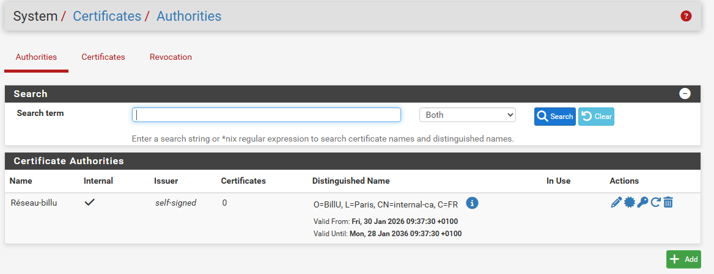
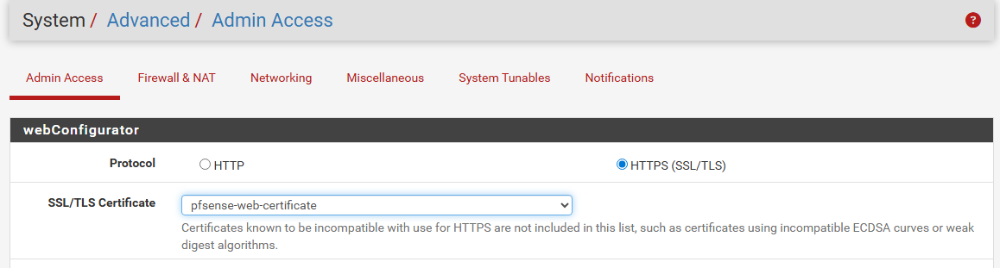
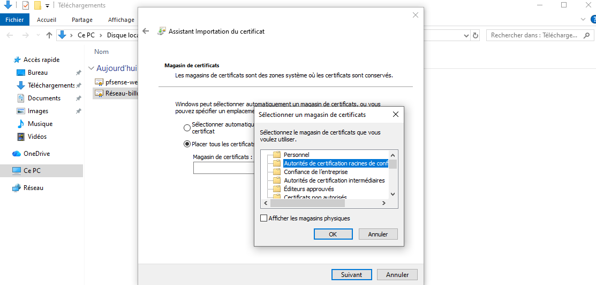

# Utilisation de pfSense

pfSense est un système dédié au firewalling. Il est installé sur des équipements matériels spécialisés (qu'on appellent firewall matériels), mais peut aussi être installé sur des machines plus classiques. Il ne nécessite d'ailleurs que peu de ressources matérielles pour fonctionner, en tout cas quand il n'a pas beaucoup de trafic réseau à traiter.

Il s'agit en pratique d'une distribution du système FreeBSD configurée et customisée pour servir de firewall facile d'accès en proposant notamment un interface web complète d'administration. Son nom fait d'ailleurs référence à Packet Filter, le firewall d'OpenBSD qui est aussi le firewall standard de FreeBSD.

#### Il offre de multiples fonctionnalités telles que

* Le filtrage réseau (bien sûr)
* DHCP
* DNS et DNS Dynamique
* Routeur avec NAT
* Pont et VLAN
* Serveur de temps NTP
* Portail captif
* Gestion de connexions Internet multiples
* ...

## Création de cerificats

### Certificat d'autorité

* Accéder au gestionnaire de certificats
* Créer une nouvelle CA dans "Authorities"

Cliquer sur le bouton + Add pour ajouter une nouvelle CA
Configurer les paramètres suivants :

Descriptive name : ex: "Billu-réseau"
Method : "Create an internal Certificate Authority"  
Key type : RSA (recommandé) ou ECDSA  
Key length : 2048 bits minimum, 4096 bits
Digest Algorithm : SHA256 ou supérieur  
Lifetime : 3650 jours (10 ans) est courant pour une CA interne

* Remplir les informations Distinguished Name (DN)

Country Code : FR (pour la France)  
State or Province : Provence-Alpes-Côte d'Azur  
City : Marseille  
Organization : Le nom de votre organisation  
Common Name : Un nom descriptif pour votre CA (ex: "CA Interne Mon-Reseau")  

### Certificat

Pour chaque serveur/service il est possible de créer un certificat basé sur le certificat d'autorité précédemment créé. Se rendre dans "Certificates" et +ADD pour une création.

* Pour l'accès web pfsense, dans Alternative Names et certificate Type, sélectionner "Server Certificate" et renseigner l'adresse IP ou FQDN si défini.
* Appliquer le nouveau certificat pour l'interface pfsense dans System > Advanced > Admin Access SSL/TLS Certificate : Sélectionnez le certificat créé.

* Télécharger et installer le certificat d'autorité sur la machine dans "Autorités de certification racines de confiance"  

  

* L'accès a pfsense en web est maintenant certifié sur la machine  
