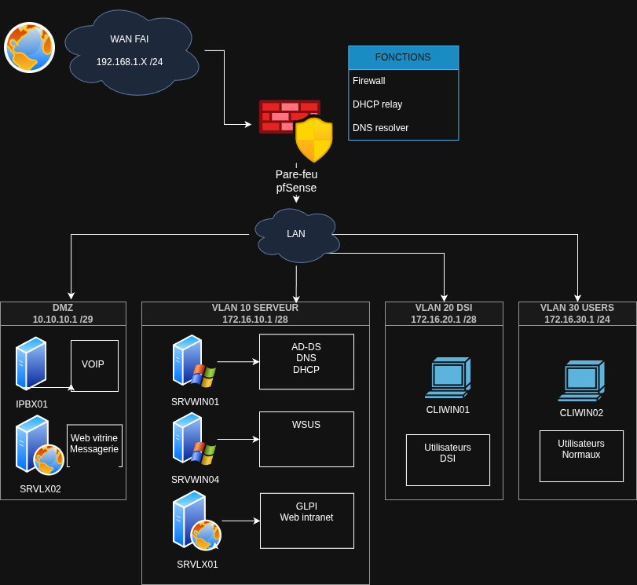

# TSSR-1025-P3-G5

Ce projet solo, réalisé dans le cadre de ma formation TSSR, vise à concevoir et déployer une infrastructure réseau complète pour l'entreprise fictive BillU, une filiale de RemindMe spécialisée dans les logiciels de facturation. L'infrastructure est simulée à l'aide de machines virtuelles (VM) sur VirtualBox, en remplaçant l'environnement actuel limité (réseau WiFi via box FAI en 172.16.10.0/24, absence de serveurs, stockage NAS grand public sans redondance, etc.) par une solution professionnelle intégrant divers services essentiels.

BillU compte 217 collaborateurs répartis en 9 départements (Communication et Relations publiques, Département Juridique, Développement logiciel, Direction, DSI, Finance et comptabilité, QHSE, Service Commercial, Service recrutement), tous basés à Paris (20e arrondissement). Le projet met l'accent sur la sécurité, la gestion des utilisateurs et des services.

### Objectifs principaux

* Pare-feu : Déploiement de pfSense (FW01) avec interfaces WAN, LAN et DMZ, règles Deny All.
* Domaine AD DS : Serveur Windows Server 2022 (SRVWIN01) avec domaine tssr.lan, OU par département, groupes AGDLP, GPO pour mots de passe, verrouillage de compte, blocage panneau de configuration, admin local, politique PowerShell, plus 2 GPO au choix.
* DNS : Zone directe sur SRVWIN01 avec enregistrements A pour les machines et forwarders.
* DHCP : Plage pour le LAN sur SRVWIN01.
* GLPI : Installation sur Debian CLI (SRVLX01 ou GLPI01) pour gestion de parc et ticketing, accessible via web.
* WSUS : Serveur dédié (SRVWIN04) pour mises à jour par groupes.
VOIP : FreePBX (IPBX01) avec lignes pour utilisateurs, validation via softphones (ex. 3CX sur clients Windows).
* Messagerie : À choisir entre Zimbra ou iRedMail sur SRVLX01, boîtes mail pour utilisateurs, validation d'envois/réceptions via clients locaux.
* Clients : 2 machines Windows (CLIWIN01 Win10, CLIWIN02 Win11) jointes au domaine.

### L'infrastructure est divisée en zones

* WAN : Connexion externe (plage IP de la box Internet, gateway interne de la box).
* LAN : Réseau interne avec serveurs et machines clients
  * 3 VLAN (Pour plus de securité et une meilleure segmentation)
    * VLAN Serveur
    * VLAN DSI
    * VLAN Utilisateurs
* DMZ : Zone pour services exposés (P3-DMZ) 10.10.10.0/24, pour WEB externe, messagerie et VOIP ?.

    inserer diagramme drawio

| Nom             | Type              | Interconnexion  | IP                | DHCP   | Compte        | MDP      |
|-----------------|-------------------|-----------------|-------------------|--------|---------------|----------|
| FW01            | Pare-feu          | WAN-DMZ-VLAN    | 192.168...... /24 | relais | admin         | pfsense  |
| SRVWIN01        | Serveur           | VLAN_10_SERVER  | 172.16.10.5       | ❌      | Administrator | Azerty1* |
| SRVLX01         | Serveur           | VLAN_10_SERVER  | 172.16.10.6       | ❌      | wilder        | Azerty1* |
| CLIWIN01        | Client            | VLAN_20_DSI     | 172.16.20.X       | ✔️     |               | Azerty1* |
| CLIWIN02        | Client            | VLAN_30_USERS   | 172.16.30.X       | ✔️     |               | Azerty1* |
| IPBX01          | VOIP              | DMZ             | 10.10.10.3        | ❌      |               | Azerty1* |
| SRWIN04         | Serveur           | VLAN_10_SERVEUR | 172.16.10.8       | ❌      |               | Azerty1* |
| SRVLX02         | Serveur           | DMZ             |                   | ❌      |               | Azerty1* |

| Pare-feu FW01   | Interfaces        |
|-----------------|-------------------|
| WAN             | 192.168...... /24 |
| DMZ             | 10.10.10.1 /29    |
| VLAN_10_SERVEUR | 172.16.10.1 /28   |
| VLAN_20_DSI     | 172.16.20.1 /28   |
| VLAN_30_USERS   | 172.16.30.1 /24   |

### Configuration des clients (Windows 10 et 11)
