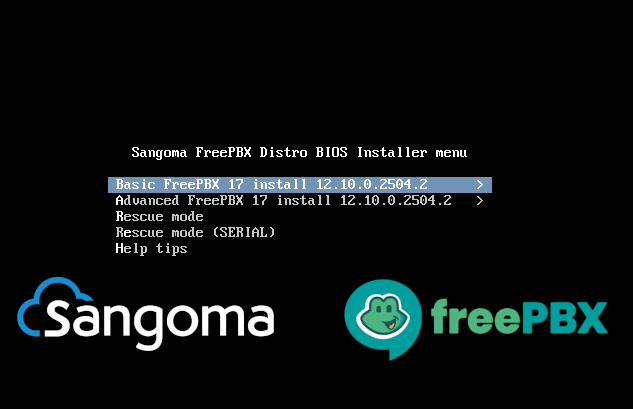
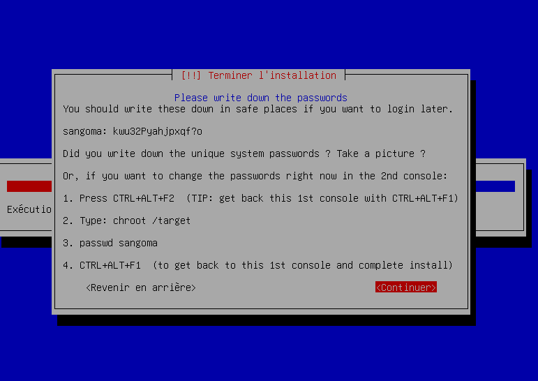
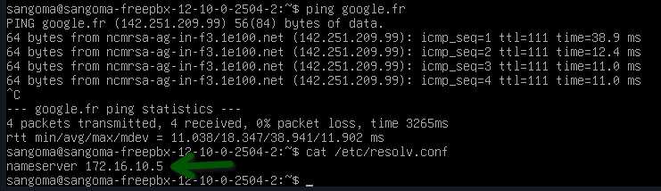
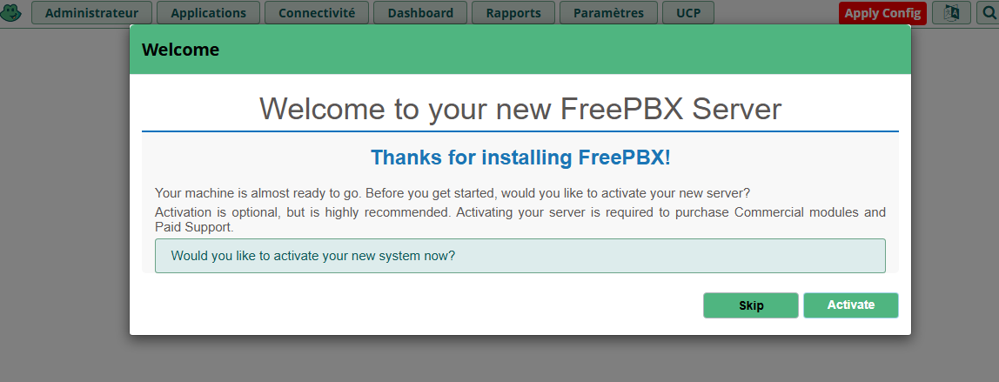
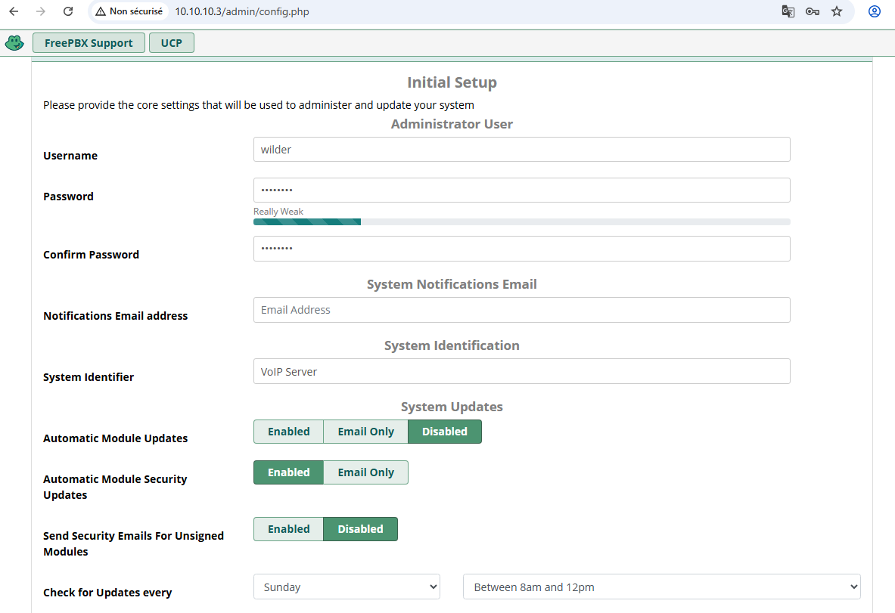

# Installation

## FreePBX 17

* Telecharger le fichier et installation du logicielen choisissant  

* Faire attention à noter le mot de passe pour terminer l'installation. Celui-ci pourra être modifié ultérieurement

* Configurer la connexion en verifiant le DNS dans resolv.conf

* L'installation terminé, nous pouvons nous connecter au GUI et démarrer le Setup initial

  
