# Utilisation

## Activation du système

* Pour une utilisation optimale

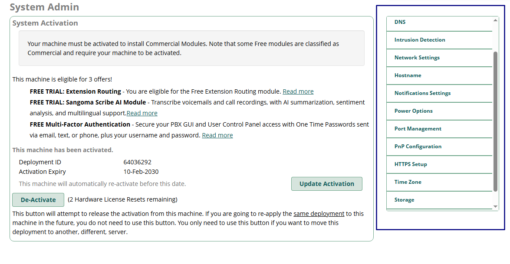

* Une fois activé, il est possible d'accéder a des paramètres réseaux importants comme le hostname

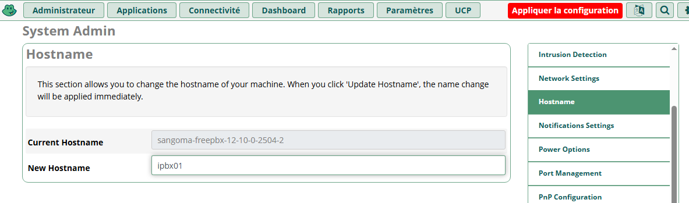  

* Nous pouvons également changer la Time Zone

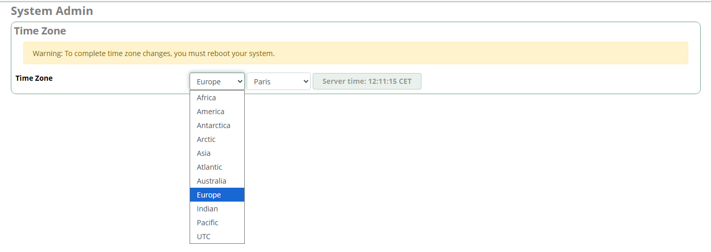  

* Le système redemmare

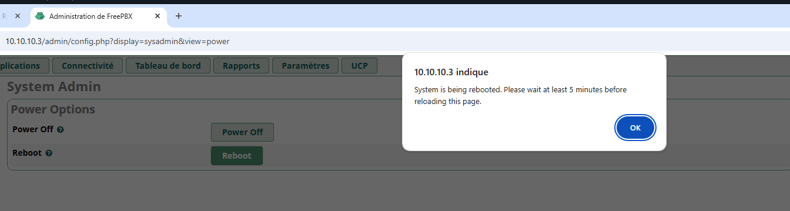  

## Mise à jour des modules

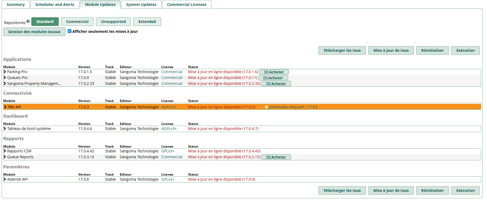  

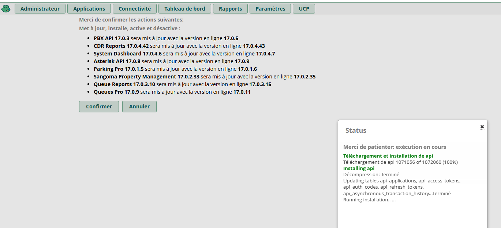

## Synchronisation avec Active Directory

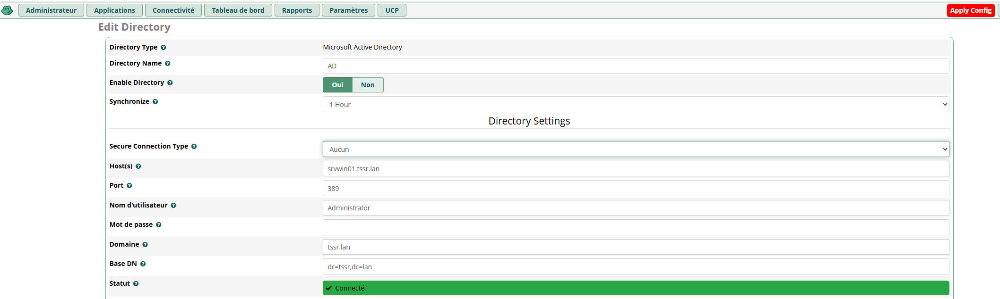

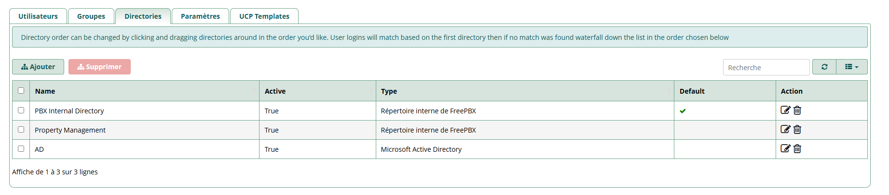

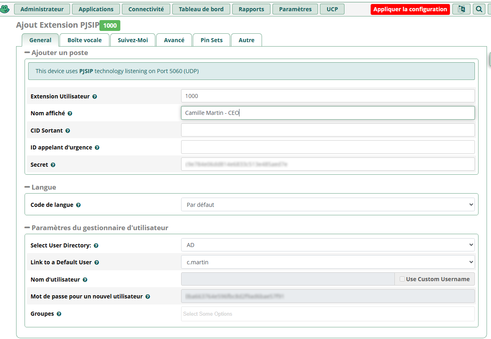

## Activation de l'UCP et de la boite vocale  

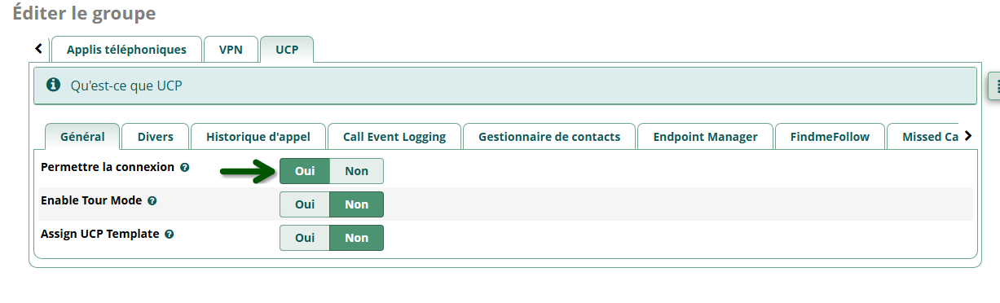

## Connexion entre softphones 3cx  

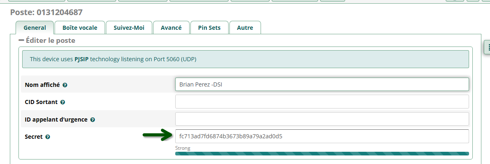

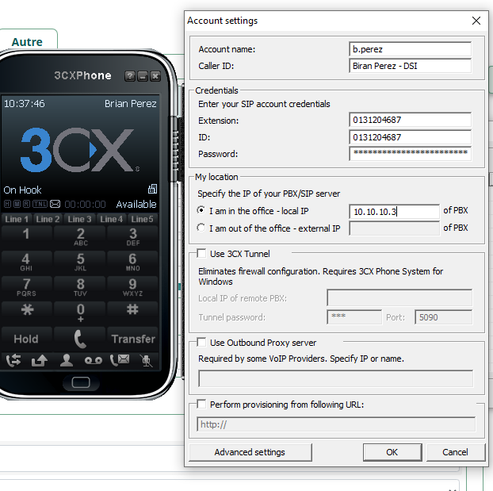

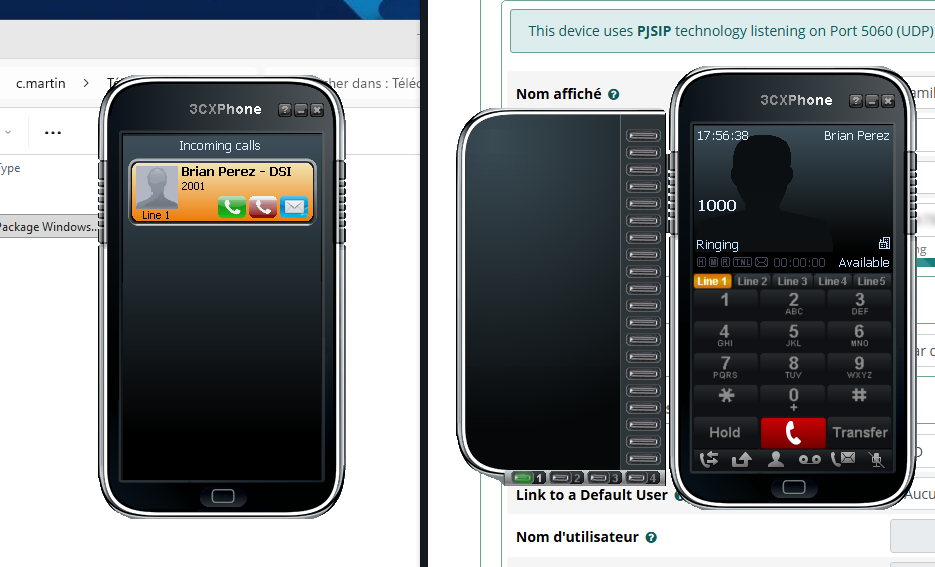
