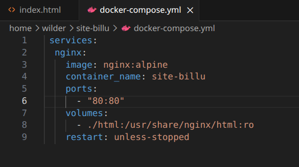

## Installation de Docker

### Créer le dossier pour les clés si nécessaire

`sudo install -m 0755 -d /etc/apt/keyrings`

### Télécharger et convertir la clé publique Docker en format binaire

`curl -fsSL <https://download.docker.com/linux/debian/gpg> | sudo gpg --dearmor -o /etc/apt/keyrings/docker.gpg`

### Donner les bons droits à la clé (lecture pour tous, mais pas modifiable)

`sudo chmod a+r /etc/apt/keyrings/docker.gpg`

### Ajouter le dépôt officiel Docker

`echo \
"deb [arch=$(dpkg --print-architecture) signed-by=/etc/apt/keyrings/docker.gpg] https://download.docker.com/linux/debian \
$(lsb_release -cs) stable" | sudo tee /etc/apt/sources.list.d/docker.list > /dev/null`

### Mettre à jour la liste des paquets

`sudo apt update`

### Installation de docker et docker compose

`sudo apt install docker-ce docker-ce-cli containerd.io docker-compose-plugin -y`

### Activer Docker au demarrage et ajout au groupe sudo (pour eviter ressaisies sudo)

`systemctl enable --now docker`

`sudo usermod -aG docker $USER`

### Vérification de l'installation Docker

`docker --version`

`docker compose version`

## Installation et configuration de Nginx

### Créer la structure du projet

`sudo mkdir -p ~/site-billu/site/{css,images}`
`sudo chown -R $USER:$USER ~/site-billu`
`cd /opt/site-billu`

### Creation du docker-compose.yml  

### Lancement du conteneur

`docker compose up -d`
