# Installation WSUS

## Windows Server Core

### Configuration

* Définir le mot de passe pour Administrator  

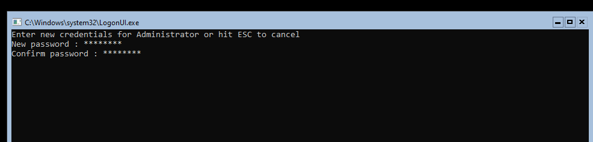  

* Dans SConfig, redefinir le nom de la machine, modifier les paramètres réseaux, rejoindre le domaine tssr.lan et autorisé remote desktop sécurisé
  
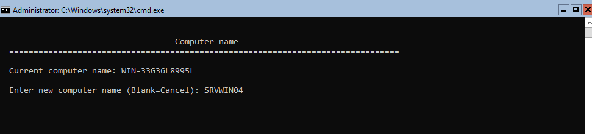
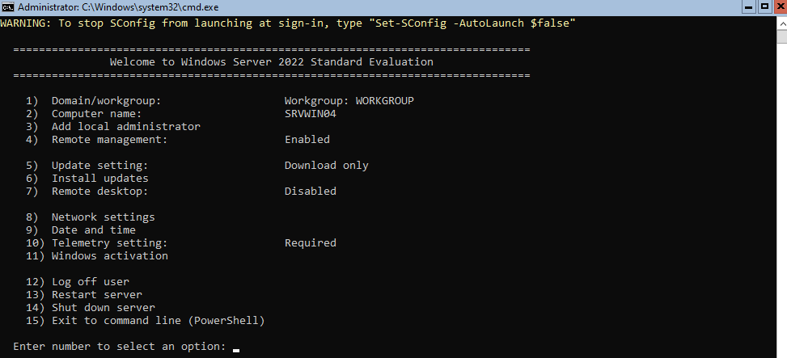
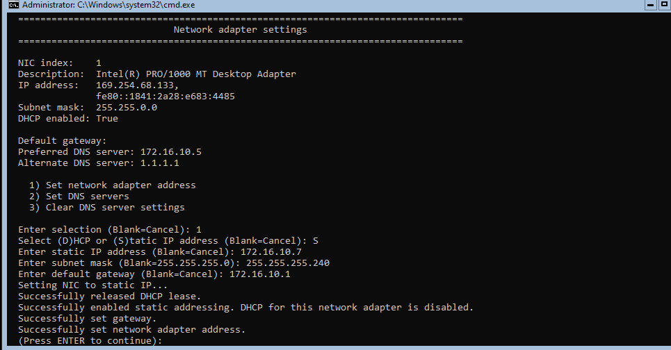
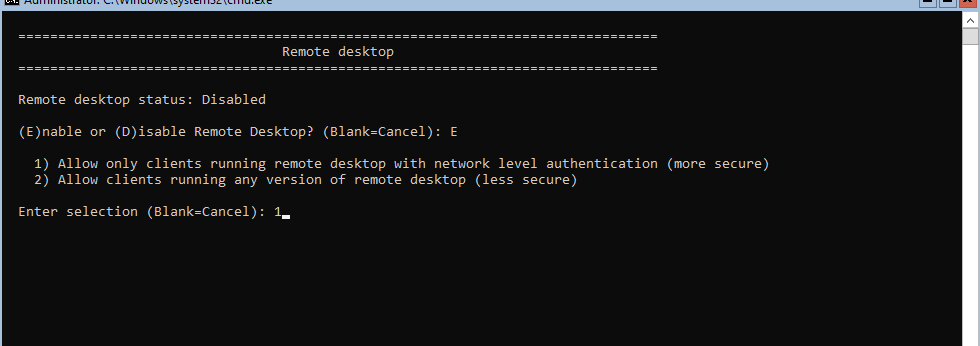
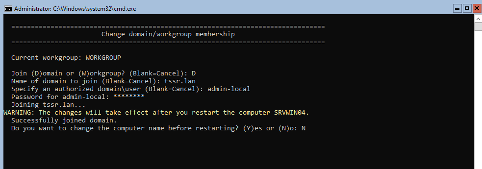  

### Régles de Parefeu

* En powershell :

`Enable-NetFirewallRule -DisplayGroup "Remote Desktop"`
`Enable-NetFirewallRule -DisplayGroup "Windows Remote Management"`
`Enable-NetFirewallRule -DisplayGroup "Remote Event Log Management"`
`Enable-NetFirewallRule -DisplayName "Remote Scheduled Tasks Management (RPC)"`
`Enable-NetFirewallRule -DisplayGroup "Remote Service Management"`  
`Enable-NetFirewallRule -DisplayGroup "Windows Defender Firewall Remote Management"`

### WSUS et outils

#### Installation de WSUS + WID + outils de gestion  

* En powershell :

`Install-WindowsFeature -Name UpdateServices, UpdateServices-WidDB, UpdateServices-Services -IncludeManagementTools -Restart`  

    * IncludeManagementTools : installe les outils (utile même sur Core pour wsusutil.exe).  
    * Restrart : Redémarre automatiquement si nécessaire.  

#### Post-installation de WSUS  

* Crér le dossier de contenu (si pas déjà fait) :  

`New-Item -Path C:\WSUS -ItemType Directory`  

* Se placer dans le dossier Tools et lancer la post installation en precisant le chemin pour le stockage (ici dans C:\WSUS) :

`cd "C:\Program Files\Update Services\Tools"`  

`.\wsusutil.exe postinstall CONTENT_DIR=C:\WSUS`

* Ajouter un groupe ou un utilisateur membre de "Domain Admins" de l'AD ayant les droits sur WSUS.  

`Add-LocalGroupMember -Group "WSUS Administrators" -Member "tssr\admin-local"`

## Sur Windows Server Desktop

* Installer les outils RSAT (Outils d’administration de serveur distant)

`Install-WindowsFeature RSAT-UpdateServices, UpdateServices-UI -IncludeAllSubFeature`
  
Ou via Server Manager / Add Roles and Features / Features / Remote Server Administration Tools / Windows Server Update Services Tools

* Ajouter le serveur core (pour gestion et controle à distance)

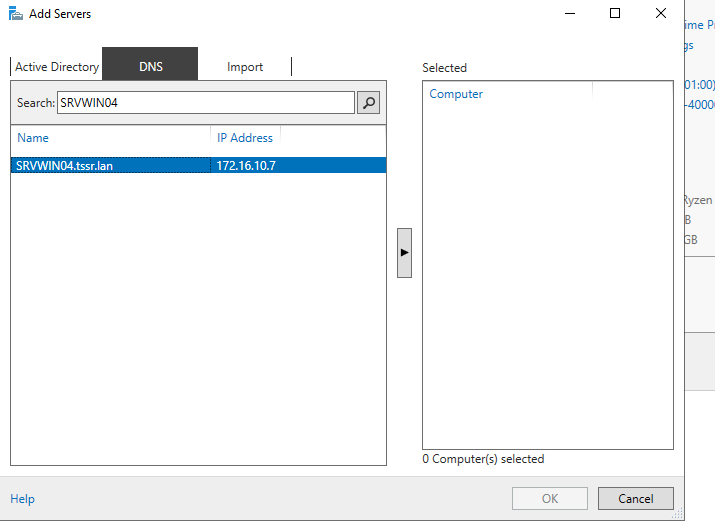

* Installer WSUS Tools et configurer le service avec le Wizard

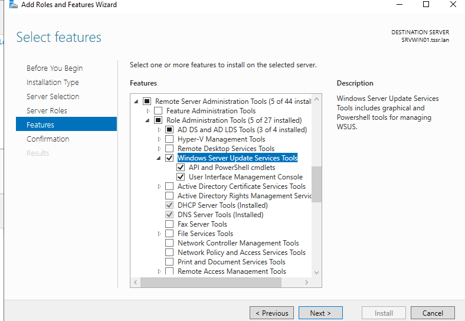

* Lancer Updates Services et connecter le serveur core

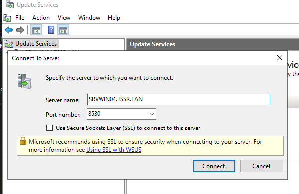

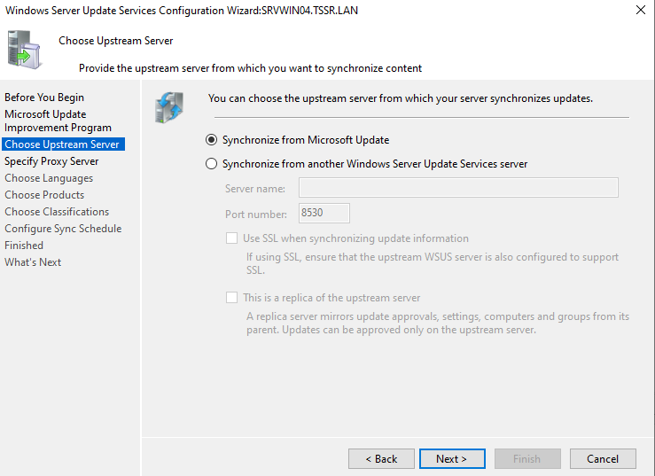

Choisir les options :

Source de synchronisation / Synchronize from Microsoft Update / Suivant  
Langues : Au moins Français et anglais / Suivant  
Produits :  
Windows 10  
Windows 11  
Windows Server 2022  
(Autres systèmes possibles mais augementation du temps de téléchargement)

Classifications au minimum :  
Mises à jour critiques  
Mises à jour de définitions  
Mises à jour de sécurité  

Synchronisation planifiée pour l'instant manuelle si problèmes de synchro  
Démarrer la synchronisation initiale  
La première synchro va prendre du temps

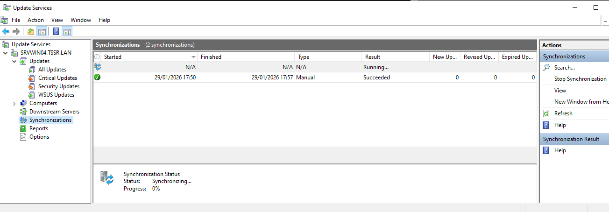

## Sur les machines clientes

* Vérifier que les ordinateurs client ont bien dans leur registres Windows update policies.  
Pour vérifier :

 `Get-ItemProperty -Path "HKLM\SOFTWARE\Policies\Microsoft\Windows\WindowsUpdate"`

* Si le registre n'existe pas, le créer et ajouter les paramètres suivants :

`Set-ItemProperty -Path "HKLM\SOFTWARE\Policies\Microsoft\Windows\WindowsUpdate" -Name "WUServer" -Value "http://srvwin04.tssr.lan:8530"`  
`Set-ItemProperty -Path "HKLM\SOFTWARE\Policies\Microsoft\Windows\WindowsUpdate" -Name "WUStatusServer" -Value "http://srvwin04.tssr.lan:8530"`  
`Set-ItemProperty -Path "HKLM\SOFTWARE\Policies\Microsoft\Windows\WindowsUpdate\AU" -Name "UseWUServer" -Value 1`

* Eventuellement si les machines ne sont pas détéctées :  

`Set-ItemProperty -Path "HKLM:\SOFTWARE\Policies\Microsoft\Windows\WindowsUpdate" -Name "AcceptTrustedPublisherCerts" -Value 1 -Type DWord`  
`Set-ItemProperty -Path "HKLM:\SOFTWARE\Policies\Microsoft\Windows\WindowsUpdate" -Name "ElevateNonAdmins" -Value 1 -Type DWord`

* forcer la dectection avec `wuauclt /detectnow`
et enfin redémarrer le service avec `Restart-Service wuauserv -force`
