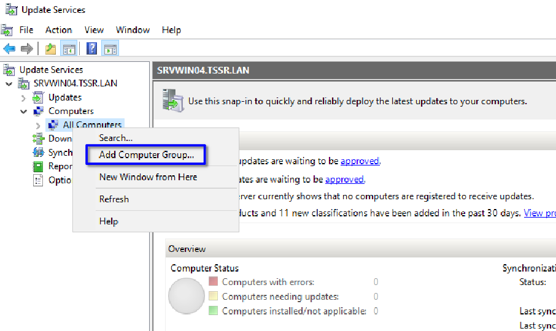
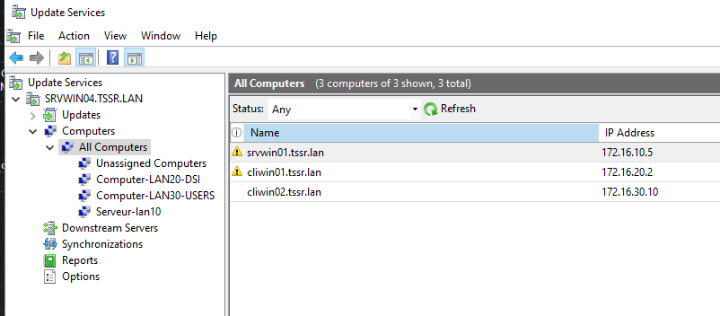
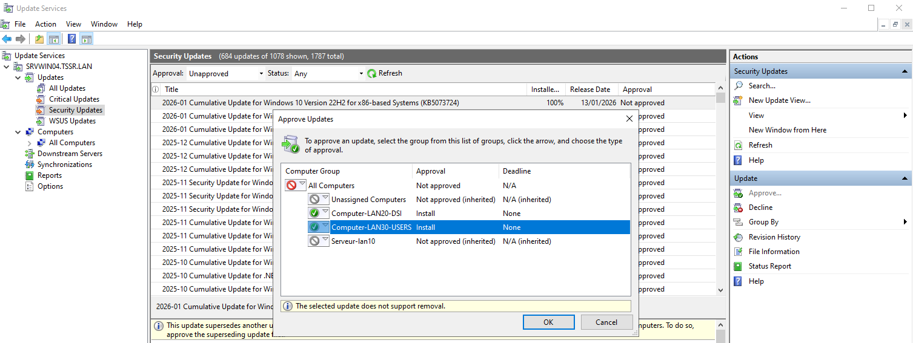
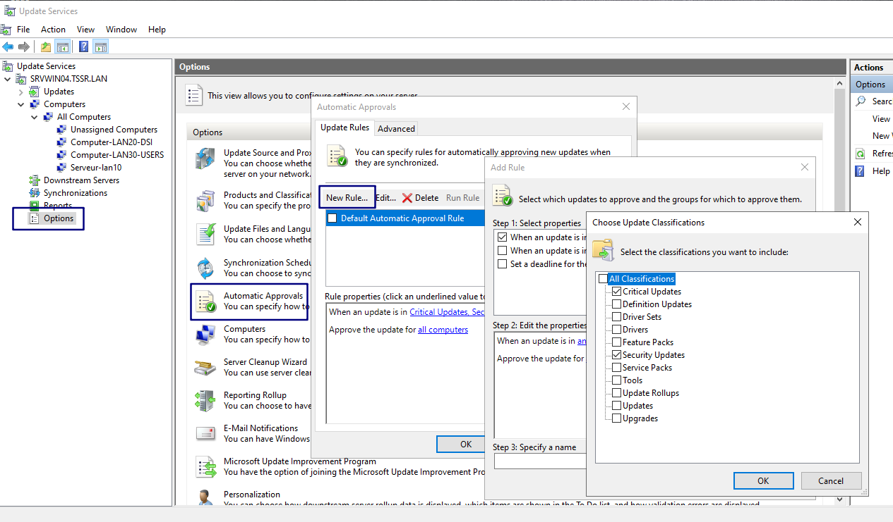
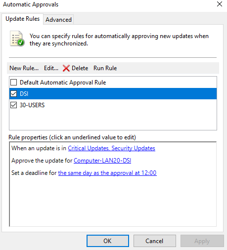

# Utilisation de WSUS

## Création de groupe locaux WSUS

* Se rendre dans update services, sur computers et clic droit pour afficher l'option Add Computer Group  
  
  

* Il est alors possible de créer différent groupe. ici nous créons un groupe pour la DSI, les utilisateurs lambdas et les serveurs.  

* Nous pouvons maintenant y affecter les machines, pour l'instant présentes dans le groupe Unassigned Computers en les selectionnant puis "Change Membership"

## Gestion de MAJ de sécurité par groupe

* Se rendre dans Security updates et approuver les dernières Maj. Les appliquer au groupes desirés

* Nous pouvons également définir des applications automatiques de mises à jours.
En se rendant dans options / Automatic approval et New Rule
* Il est alors possible de filtrer par groupe, type de Maj et délai de validation.

* Pour les ordianteurs de la DSI nous appliquons les Maj critiques et de securité automatiquement le jour même.

* Nous pouvons retarder de quelques jours celles pour les utlisateurs lambdas ainsi que les Maj non essentielles (fonctionnalités, updates et drivers), pour laisser à la DSI le temps de les évaluer.

* Nous laissons les Maj des serveurs en "manuel" pour des raisons de stabilité.
